## Acknowledgements

::: {.column width="30%"}
### [**Coauthors**]{.underline}

Tamaragh Malone
:::

::: {.column width="30%"}
### [**Funding**]{.underline}


:::

::: {.column width="40%"}
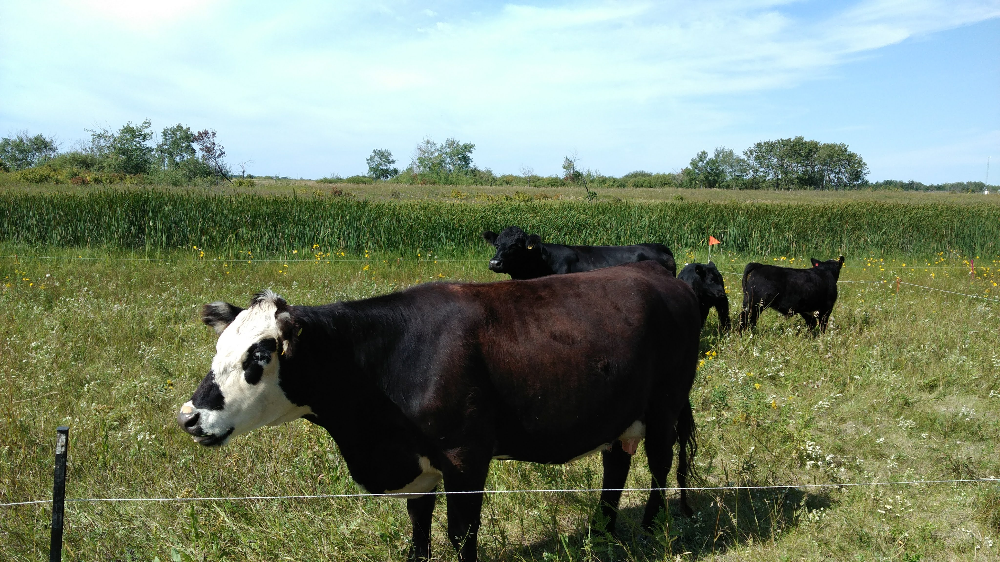{fig-align="center"}
:::

::: {layout="[1,0.8,0.3]" layout-valign="center"}


:::

```{r}
library(tidyverse)
```

## Riparian areas
::: {.column width="50%"}
- Important ecological areas
    - Nesting habitat
    - Transportation cooridors
    - Refuge for benficial plants  and insects
    
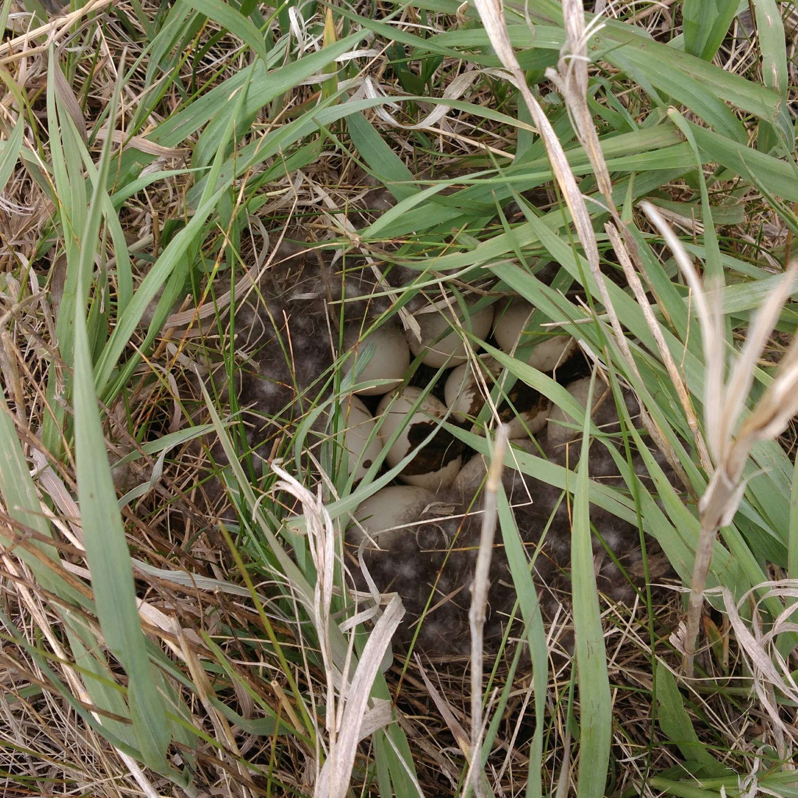{width=48%}
:::

::: {.column width="50%"}

- Hydrologically important
  - Bank stabilization
  - Water temperature regulation
  - Reduce flooding risk
  


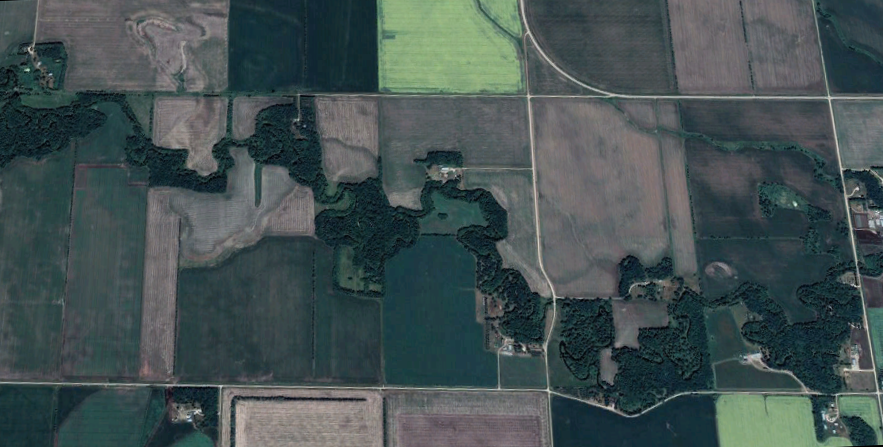   

:::

## Riparian areas
::: {.column width="50%"}
- Part of the farm
    - Account for 5 to 10% of the farm area
    - Important source of forage
    
](figs/riparian grazing.png){width=45%}
:::

::: {.column width="50%"}
- Riparian areas are maintained to intercept and store nutrients
    - BMP to improve water quality

](figs/Buffer_man.png){width=40%}   
:::
    
## Riparian areas as filters
### Typical prairie riparian area during the snowmelt period
- Most P loading occurs during the spring snowmelt
- Frozen soils and dead and dormant vegetation
    - Filtering capacity is not not very good during the most critical period
- Vegetation can be a source of P
    
::: {layout-ncol=2}

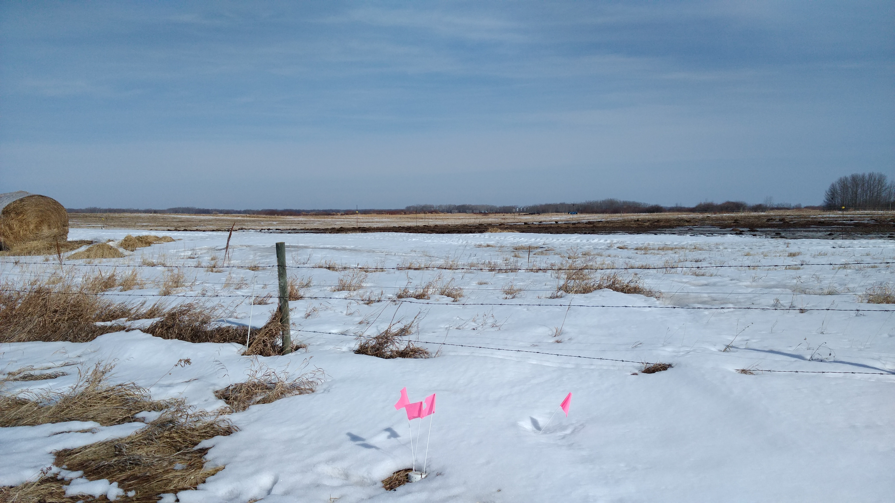

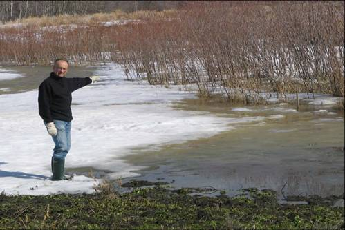

:::

## Research objectives


::: {.column width="70%"}

### Can we use riparian cattle grazing to reduce the risk of P loss?

1. Assess the distribution of P in two directions

**Vertical**

- Biomass, Litter, Organic layer, Ah (0-10)

**Longitudinal**

- Upper, mid, lower 

2. Quantify the net change in P following grazing
:::

::: {.column width="30%"}
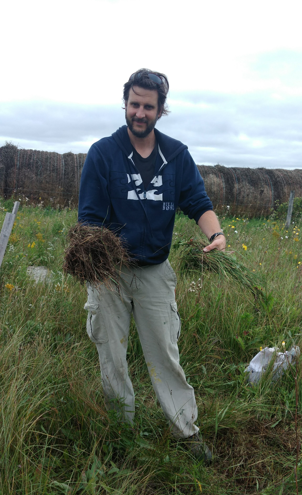
:::
## Location

### Four riparian areas at the [MBFI](https://www.mbfi.ca/) research farm
- South-western Manitoba

](figs/Figure 1.png)

## Treatments
::: {.column width="50%"}

1.  Control
2.  Grazing
3.  High-density grazing
4.  Mowing

- Fall grazing
    - Drier soils
    - Protect habitat
    - Extending gazing season
    - Remove P prior to winter
    
:::

::: {.column width="50%"}
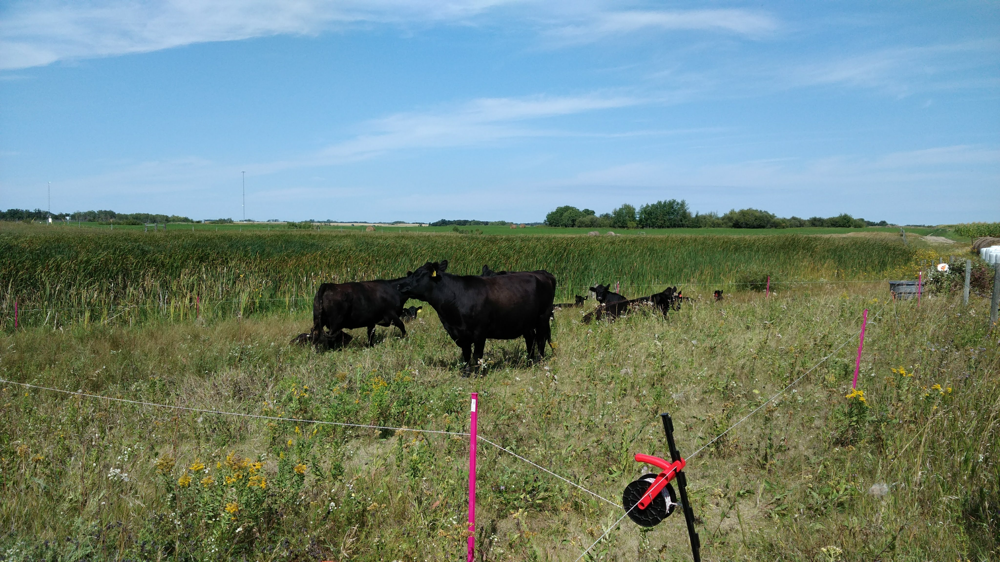
:::

## Sampling
::: {.column width="50%"}
### Sample collection 
- Pre- and post-grazing
- Biomass and litter
    - 0.25 m^2^ quadrate
- Organic and Ah
    - Soil probe
    
### Sample analysis
- Wieghed
- Dried and homogenized
- Water extraction
- Molybdate–ascorbic acid method

:::

::: {.column width="50%"}

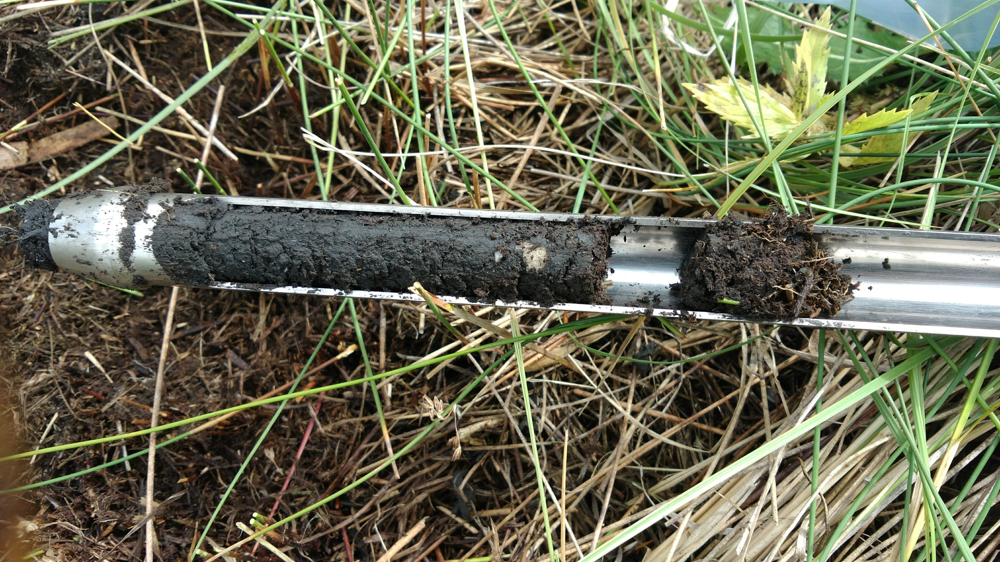{width=75%}

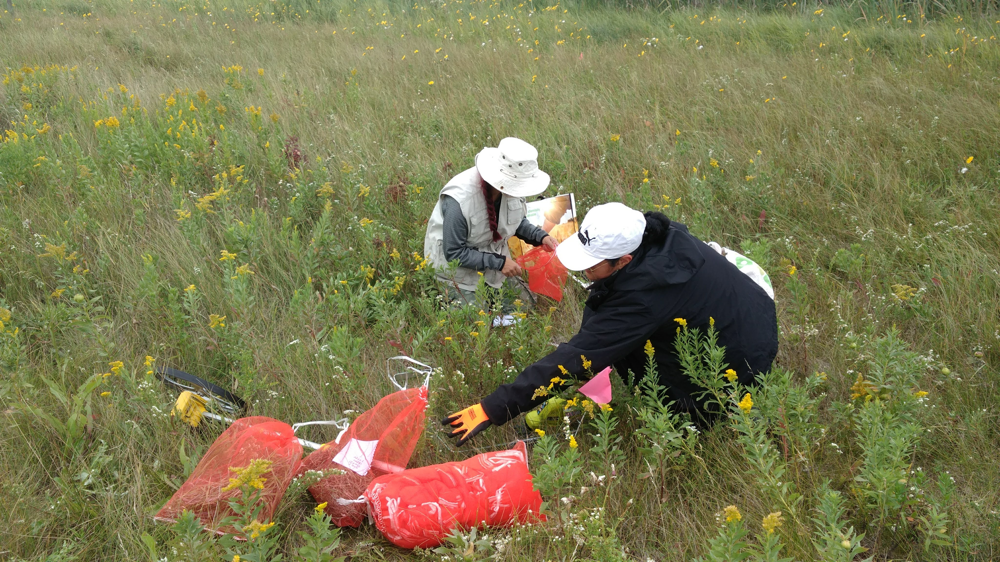{width=75%}
:::
## Distribution of P

- Biomass and litter are large sources of P

](figs/Figure 2.png)

## Biomass

- High density grazing and mowing reduced the amount of P
- More P removed in lower slope locations

](figs/Figure 3.png)

## Litter
- No treatment effect
- High variability 

](figs/Figure 4.png)

## Organic layer
- No treatment effect
- High variability 

](figs/Figure 5.png)

## Ah

- No treatment effect
- High variability 

](figs/Figure 6.png)

## Variabilty

::: {.column width="50%"}
- Variabilty is high
  - Above and below ground
  - Even in the control plots
  - Makes detecting small changes difficult

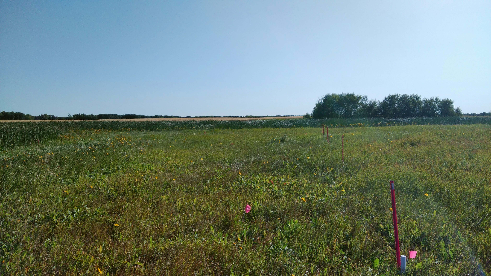 
:::

::: {.column width="50%"}

- Hotspots
  - Manure/urine
  - Plant species
  - Biophysical processes 

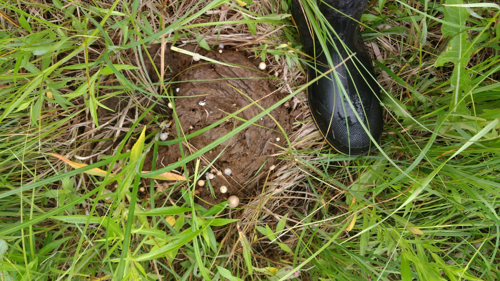  
:::  
  
## Conclusions

- Fall riparian grazing reduced the amount of biomass P
    - Reduced risk of P loss during snowmelt

- Variability is high
  - Sampling design needs to accomdate this

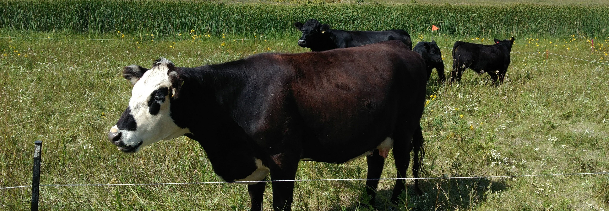{fig-align="center"}  


## Effects of Riparian Grazing on Distinct Phosphorus Sources


::: {.absolute bottom="100" left="600" width="150%"}

[**Want to learn more?**]{style="color:#094218;"}


:::
```{r, eval=FALSE}

code <- qrcode::qr_code("https://github.com/alex-koiter/presentations/tree/main/MSSS_2025/Riparian_grazing")

qrcode::generate_svg(code, filename = here::here("./MSSS_2025/Riparian_grazing/figs/qr.svg"))

```


::: {style="position:absolute; bottom:20%"}
 `r icons::fontawesome("globe")` [**alexkoiter.ca**](https://alexkoiter.ca)<br> `r icons::fontawesome("envelope")` [**koitera\@brandonu.ca**](mailto:koitera@brandonu.ca)<br> `r icons::fontawesome("github")` [**alex-koiter**](https://github.com/alex-koiter)<br> `r fontawesome::fa("bluesky", fill = "black")` [**alex-koiter**](https://bsky.app/profile/alex-koiter.bsky.social)<br> `r icons::fontawesome("mastodon")` [**\@alex_koiter\@smstdn.ca**](https://mstdn.ca/@Alex_Koiter)<br> `r icons::fontawesome("linkedin")` [**Alex-Koiter**](https://www.linkedin.com/in/alex-koiter-43b04b2a8/)<br> `r icons::fontawesome("twitter")` [**\@alex_koiter**](https://twitter.com/alex_koiter)
:::

[*Slides created with [Quarto](https://quarto.org)*<br>Updated `r Sys.Date()`]{.small .absolute bottom="50"}
