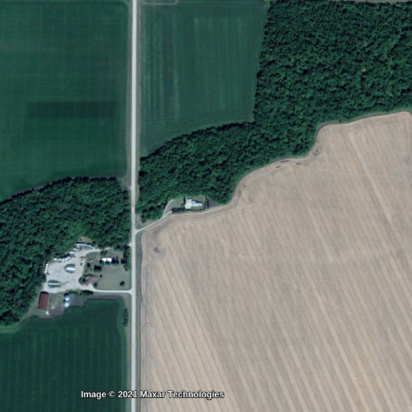
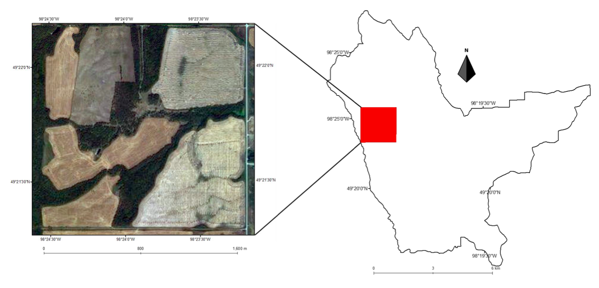
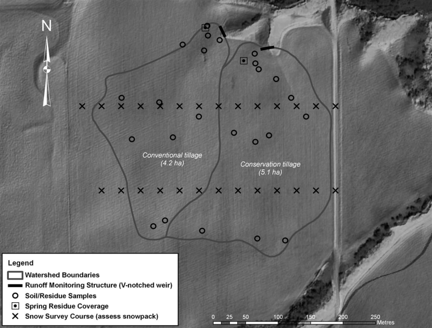

class: title-slide, nobar

```{r setup, include = FALSE}
library(icons)
library(stringr)
library(glue)

knitr::opts_chunk$set(fig.width = 6, fig.asp = 0.5, out.width = "100%", 
                      dpi = 250, fig.align = "center",
                      echo = FALSE, message = FALSE,
                      cache = TRUE)

# Use title as alt text for icons
icon2 <- function(icon, title, icon_fun = ionicons) {
  icon <- icon_fun(icon)
  icon <- as.character(icon)
  if(str_detect(icon, "<title>")) {
    str_replace(icon, "<title></title>", glue("<title>{title}</title>")) %>%
      icons:::add_class("icon")
  } else {
    str_replace(icon, 
                "(http://www.w3.org/2000/svg\">\n )", 
                glue("\\1<title>{title}</title>")) %>% 
      icons:::add_class("icon")
  }
}

```


### Manitoba Association of Watersheds
# **Prairie Riparian Areas: Opportunities and Challenges for Production and Conservation**


.footnote[
### Alex Koiter
]

---
# Land and water acknowledgement


.center[
We are gathered here to talk about land and water in Manitoba and it is important to recognize the
relationships between the landscape and humanity


A big part of this is understanding and appreciating both the history and future of this relationship

]


> It is important for us to acknowledge that Brandon, and the surrounding area, are the traditional homelands of the Dakota, Anishinabek, Oji-Cree, Cree, Dene and Metis peoples


???
- A big part of this is understanding and appreciating both the history and future of this relationship
- This provides valuable context when discussing stewardship and management of natural resources

---
# A little about me
- Associate professor
    - Brandon University, Department of Geography & Environment
- Interested in watershed science
    - Soil and water quality
    - Hydrology
    - Agriculture
    - Geomorphology


---
# Thanks to

.pull-left[ 
- Collaborators & research groups
    - David Lobb (U of M)
    - Phil Owens (UNBC)
    - Merrin Macrae (U of W)
]

.pull-right[ 
- Funding 
    - Lake Winnipeg Basin Stewardship Fund
    - NSERC
    - ECCC
    - Ducks Unlimited Canada
    - AAFC
    - Deerwood and Soil and Water Management Association
    - Manitoba Beef & Forage Initiatives
]


.footnote[[Dominic McKenzie](https://www.theguardian.com/commentisfree/2017/sep/30/we-hail-individual-geniuses-success-in-science-collaboration-nobel-prize)]

---
# What is a riparian area?

- Transitional zone between the aquatic part (the waterfilled basin of the lake or wetland) and the surrounding terrestrial (or upland) area  [(Cows and Fish 2009)](https://cowsandfish.org/wp-content/uploads/LakesandWetlandsRHAWorkbook2020.pdf)
- "Wetter than dry” but “drier than wet” [(MB Ag)](https://www.manitoba.ca/water/groundwater/riparian_areas/index.html)
- The strip of moisture-loving vegetation growing along the edge of a natural water body [(Hilliard & Reedyk 2020)](https://agriculture.canada.ca/en/agriculture-and-environment/soil-and-land/riparian-area-management)


---
# What is a riparian area?
## Goes by many names
- Vegetated buffer strip
- Vegetated filter strip
- Buffers
- Riparian corridor
- Grass buffer
- Riparian forest


.footnote[[USDA](https://en.wikipedia.org/wiki/Riparian_zone#/media/File:Riparian_strip.jpg)]

---
# What does a riparian area look like?
- Trees around a small retention dam


---
# What does a riparian area look like?
- Grasses around a small wetland


---
# What does a riparian area look like?
- Trees along a stream




---
# What does a riparian area look like?
- Do wet depressional areas have a riparian zone?


---
# What does a riparian area look like?
- Do ditches have a riparian zone?


---
# Defining a riparian area
## Where does (should) it start and end?
- Historical observations
- Too steep/wet to farm
- Fence line
- Vegetation types
- Hydrology
- Ecosystem function
- Regulatory


.footnote[[Stutter et al. 2021](https://doi.org/10.1016/j.scitotenv.2020.143982)]

---
# Riparian functions
## Recreation


---
# Riparian functions
## Habitat
- High plant and animal biodiversity
- Important corridors in a very fragmented landscape


---
# Riparian functions
## Channel characteristics
- Changes in the vegetation resulted in changes in characteristics
    - Treed vs grassed [(Satchithanantham et al. 2019)](https://www.facetsjournal.com/doi/10.1139/facets-2018-0036)
    


---
# Riparian functions
## Part of the farm
- Riparian areas can account for 5 to 10% of the farm area
    - Up to 25% in the prairie pothole region


---
# Riparian functions
## Part of the farm
- Important source of forage, especially during drought


.footnote[[AWES](https://www.awes-ab.ca/wp-content/uploads/2018/04/Grazing-Livestock-in-Riparian-Areas.pdf), [Cows and Fish Program](https://cowsandfish.org/wp-content/uploads/2017/04/greenzone3rd.pdf)]

---
# Riparian functions
## Surface water managment
- Often cited as an effective means of reducing the loading of nutrients to surface waters
    - Nutrients, sediment, pathogens, and <br/>other pollutants are filtered by riparian <br/>soil and vegetation
- Slow runoff $\rightarrow$ reducing peak flows


.footnote[[Planning for the Protection of Riparian Areas](https://www.gov.mb.ca/mr/land_use_dev/pubs/riparian_area_guide.pdf), [Stewart et al. 2010](https://publications.gc.ca/site/eng/387724/publication.html)]

---
# Riparian functions
## Surface water managment
- Eutrophication and algae blooms <br/>on Lake Winnipeg
    - Lots of public interest/pressure/outrage <br/>in improving water quality
- Riparian areas are considered <br/>part of the solution    


.footnote[[Lake Winnipeg Foundation](https://lakewinnipegfoundation.org/tags/eutrophication)]

---
# Riparian areas as filters
## Experimental (lab and field)
- Uniform flow of water
- Newly established
- Warm climate/temperature
- Rainfall

## Provides lots of good and <br/>important information but <br/>how well does it transfer to <br/>the prairie landscape?


.footnote[[Abu-Zreig et al. 2004](https://doi.org/10.1002/hyp.1400)]

---
# Riparian areas as filters
## Uniform flow of water?
- Lots of nice looking riparian areas in this section



.footnote[[Habibiandehkordi et al. 2019](https://acsess.onlinelibrary.wiley.com/doi/full/10.2134/jeq2018.04.0129)]

---
# Riparian areas as filters
## Uniform flow of water?
- Only 1-2% of the length of the field-edge vegetation intercepts surface runoff
    - Convergence in the landscape results in concentrated <br/>flow paths
    - Most of the riparian areas are **NOT** filtering runoff
    - Variable width may help improve filtering with out <br/>putting land out of production
    


---
# Riparian areas as filters
## Warm climates and rainfall events
- Information on the efficacy of riparian areas in other locations may not be the same here
    - Snowmelt driven hydrology
    - Most of the time riparian areas <br/>are **NOT** filtering runoff


.footnote[Tobacco Creek Model Watershed]

---
# Riparian areas as filters
## Inter-annual variability
- Lots of variability between years
    - A few years can account for <br/>much of the total flow
    - Riparian areas are more <br/>important in some years but <br/>less so in others


.footnote[Tobacco Creek Model Watershed]

---
# Riparian areas as filters
## Typical prairie riparian area during the snowmelt period
- Frozen soils and dead and dormant vegetation
    - Filtering capacity is not not very good during the most critical period
    


---
# Riparian areas as filters
## Sediment and nutrient accumulation
- Accumulation of soil at the edge of the field an within the riparian area
    - Created a step (tillage erosion)


.footnote[[Habibiandehkordi et al. 2019](https://acsess.onlinelibrary.wiley.com/doi/full/10.2134/jeq2018.04.0129)]

---
# Riparian areas as filters
## Sediment and nutrient accumulation
- Accumulation of nutrients at the edge of the <br/>field an within the riparian area
    - Ability to retain nutrients <br/>declines over time


.footnote[[Habibiandehkordi et al. 2019](https://acsess.onlinelibrary.wiley.com/doi/full/10.2134/jeq2018.04.0129)]

---

# Riparian areas as filters
## Assessing the filtering capabilities
- Three sites across MB


.footnote[[Habibiandehkordi et al. 2017](https://link.springer.com/article/10.1007/s11356-017-9406-6)]

---
# Riparian areas as filters and sources
## Riparian areas can be a source of dissolved nutrients
- Both the soil and vegetation can contribute


.footnote[[Habibiandehkordi et al. 2017](https://link.springer.com/article/10.1007/s11356-017-9406-6)]

---
# Riparian areas as sources
## Freeze-thaw
- Freezing vegetation releases <br/>water soluble P

    


.footnote[[Noyes et al. 2021](https://uwaterloo.ca/scholar/mmacrae/people/isaac-noyes)]

---
# Riparian areas as sources
## Freeze-thaw
- Different vegetation types have <br/>different potential to release P


.footnote[[Noyes et al. 2021](https://uwaterloo.ca/scholar/mmacrae/people/isaac-noyes)]

---
# Riparian areas as sources
## Freeze-thaw
- Many lab experiments use unrealistic temperatures
    - Snow is a good insulator
    


.footnote[[Noyes et al. 2021](https://uwaterloo.ca/scholar/mmacrae/people/isaac-noyes)]


---
# Riparian areas as sources
## Flooding
- Prolonged flooding makes the <br/>soils anaerobic
    - Can enhance P release <br/>from soils
    
    

.footnote[[Concepcion et al. 2020](https://acsess.onlinelibrary.wiley.com/doi/10.1002/jeq2.20179)]

---
# Riparian areas as filters
## Riparian areas are the LAST line of defense
- Manage soils and crops to reduce the <br/>runoff and nutrients leaving agricultural <br/>land
    - Conservation tillage can increase <br/>dissolved P losses
    
  

.footnote[[Tiessen et al. 2010](https://doi.org/10.2134/jeq2009.0219)]

---
# Riparian areas as filters and sources
## Other considerations
- Manage soils and vegetation in the riparian area
    - Harvest as a removal mechanism
    - Terrain can be difficult for equipment
- Riparian areas are more than just filters
    - Habitat, stream stabilization etc.
    
   

 

---
# Managing riparian areas
## Cattle grazing
- Fall grazing
    - Drier soils (less compaction)
    - Limit disturbance to active nests
    - Extending the gazing season
    - Remove vegetation prior to winter
    
 

 

.footnote[[MBFI](https://www.mbfi.ca/)]

---
# Managing riparian areas
## Cattle grazing
- 4 treatments 
    - Control (do nothing)
    - Regular graze
    - High graze
    - Mow
- Distribution of P
    - Biomass
    - Litter
    - O horizon
    - Mineral soil
    
 

.footnote[[Avila 2021](https://alexkoiter.ca/lab.html)]

---
# Managing riparian areas
## Cattle grazing
- Preliminary results

 

 

---
# Whats next?
## Challenges and opportunities
- Addressing water quality and quantity before it gets to the riparian area
    - Remember riparian areas are the last line of defense
    - Practices that promote efficient use of water and nutrients should remain a priority
    
## Easier said than done!

- Management practices to address one issue may have unintended consequences

---
# Whats next?
## Challenges and opportunities    
- The concepts of healthy soils and crops should be extended beyond the fence line
    - Farm doesn't end at the field edge
    - Need to balance other riparian functions

 

---
# Whats next?
## Challenges and opportunities
- Need home-grown cold-climate research to support decision making

 

.footnote[[Kieta et al. 2019](http://dx.doi.org/10.1139/er-2017-0077)]

---
# Whats next?
## Challenges and opportunities
- Cold climate and snowmelt driven hydrology <br/>in the prairies means we can't completely <br/>depend on riparian areas to improve <br/>water quality
    - Other management options should be explored

 

.footnote[[Tiessen et al. 2011](https://doi.org/10.2489/jswc.66.3.158)]

---
# Whats next?
## Challenges and opportunities
- Cold climate and snowmelt driven hydrology <br/>in the prairies means we can't completely <br/>depend on riparian areas to improve <br/>water quality
    - Other management options should be explored

 

.footnote[[Vanrobaeys et al. 2019](https://dx.doi.org/10.2134/jeq2018.12.0452)]

---
# Whats next?
## Challenges and opportunities
- Increases in the frequency of severe weather and flooding
    - Are riparian areas designed <br/>and maintained to <br/>accommodate this?
    - This is when we need riparian <br/>areas the most!

 

.footnote[[Toronto Star](https://www.thestar.com/news/insight/2011/05/21/flooding_used_to_bring_fertility_now_it_means_disaster.html)]


---
# Whats next?
## Creative designs will likely take a team

- Producers
- Indigenous leaders and community
- Engineers
- Hydrologists
- Biogeochemists
- Pedologists
- Biologists
- Ecologists
- Economists
    
 

.footnote[["spaghetti and meatballs"; Olson et al. 2007](http://dx.doi.org/10.1016/j.foreco.2007.03.053)]    
---
# Whats next?
## Challenges and opportunities
- If you have had good success, or challenges, with building, maintaining, and using riparian areas please come and chat with me
- It's a great way for me to:
    - Learn what others are doing (no need to reinvent the wheel, or make the same mistakes)
    - Explore the questions and directions research should be addressing
    - Make new collaborations
    

---
# Take home messages
- Multiple functions (more than just a filter)
- Cold climate & snowmelt driven hydrology
- Concentrated flow paths
- Part of the farm


.center[
### Thank you!
]


.footnote[

`r icon2('logo-twitter', 'Twitter')` @Alex_Koiter&nbsp;  | `r icon2('logo-github', 'GitHub')` alex-koiter&nbsp;&nbsp;   | `r icon2('globe-outline', 'World wide web')` alexkoiter.ca<br> <br>
.small[
Slides: <https://github.com/alex-koiter/presentations> ([PDF](https://raw.githubusercontent.com/alex-koiter/presentations/main/Manitoba%20Association%20of%20Watersheds/MAW_Koiter_2021.pdf))  
Created with the R package [xaringan](https://github.com/yihui/xaringan), using [remark.js](https://remarkjs.com), [knitr](http://yihui.name/knitr), and [R Markdown](https://rmarkdown.rstudio.com)<br>
Icons from [Ionicons](https://ionic.io/ionicons); Compiled on `r Sys.Date()`]]
