class: title-slide, nobar, center
background-image:  url(`r "./figs/sediment_cropped.jpg"`)
background-position: bottom 85px center
background-size: cover

.align-bottom-left[  @Alex_Koiter  alex-koiter  alexkoiter.ca  koitera@brandonu.ca]

# Perspectives on Connectivity in Canadian Watersheds 

.spacer[ ]

.spacer[ ]

.spacer[ ]

.spacer[ ]

## .center[Alex Koiter .small[Brandon University]]

---
# How it all started

## CAG 2021
- Workshop on watershed connectivity
- Short presentations on recent and ongoing projects across Canada
- Lots of Q and A and discussion following

## Participants
- Genevieve Ali, Faran Ali, Stephen Dery, Masoud Goharrokhi, Sirja Islam, Kristen Kieta, David Lobb, Merrin Macrae, Issac Noyes, Phil Owens, Ellen Petticrew, Kokulan Vivekananthan 

---
# How its going
## Draft paper being written 
- State of knowledge
- Major themes
- Implications

## Consider this presentation an early test drive of a forthcoming publication
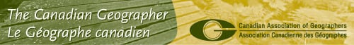 
---
# What goes in must ...
## The path from source to sink is rarely straightforward
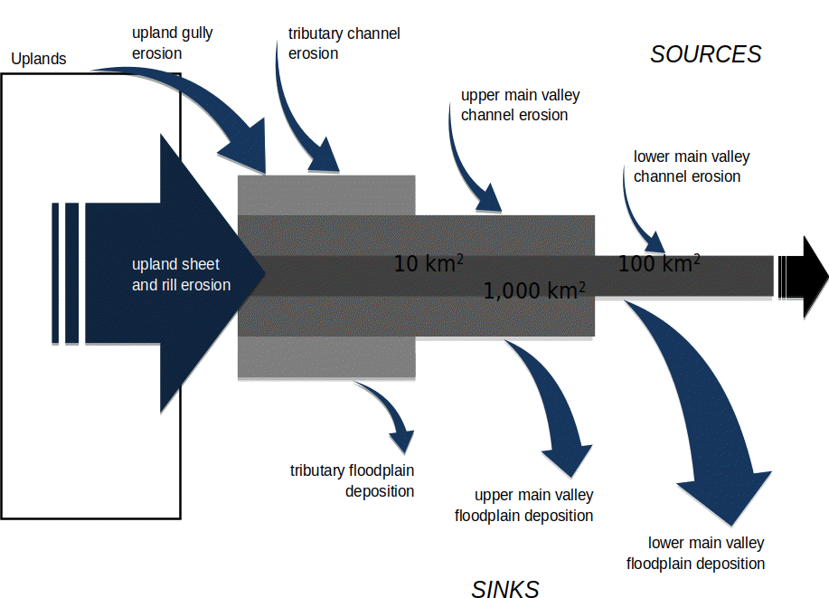 

Lobb 

---
# Types of connectivity
## Structural
- Configuration of landscape elements
    - Location, size, shape, number 

## Functional
- Linkage of landscape elements by a process(es)
    - Flows of energy and materials

## Changes
- Alteration of the structure and function over time
    - Function-structure feedback

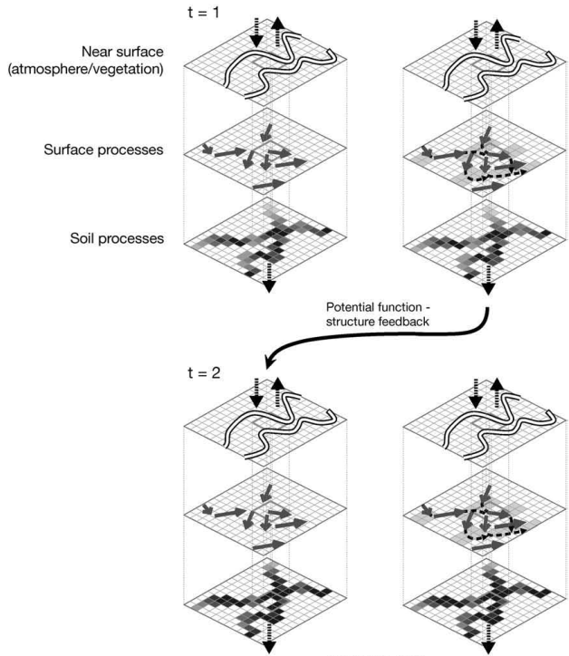     

Wainwright et al. 2011 

---
# Scale
## Degree of connectivity depends on the temporal and spatial scale of observation/interest
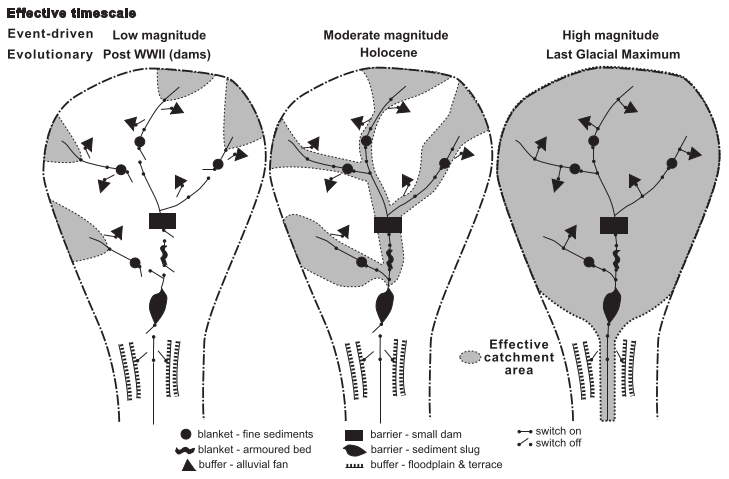 

 Fryirs 2011 

---
# Land use change
## Forestry
- Reduced evapotranspiration $\rightarrow$ Increased connectivity
- Increased LWD $\rightarrow$ Decreased connectivity
- Increased landslides $\rightarrow$ ??

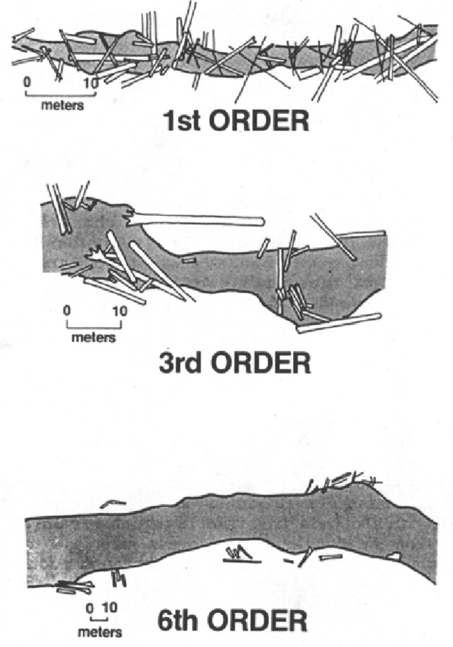 

 Booth et al. 1997 

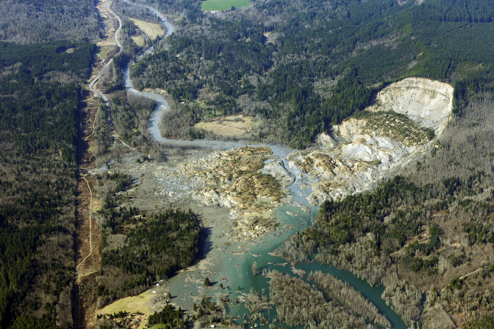 

---
# Land use change
## Agriculture
- Creation of surface and subsurface drains $\rightarrow$ Increased connectivity
- Drainage of wetlands $\rightarrow$ Increased connectivity
- Tillage ridges $\rightarrow$ Decreased connectivity

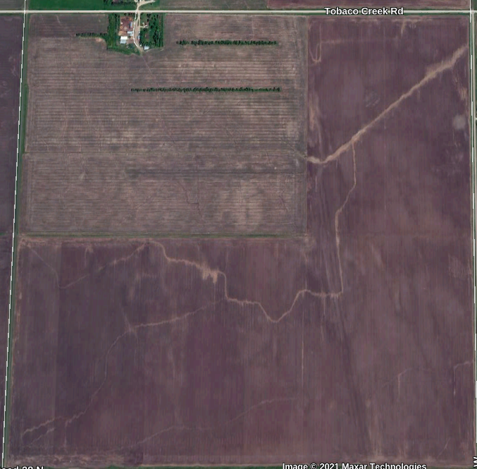 

---
# River channel changes
- Dams and reservoirs $\rightarrow$ Decreased connectivity
- Channelization in urban areas $\rightarrow$ Increased connectivity
- Culverts $\rightarrow$ Depends on design and purpose

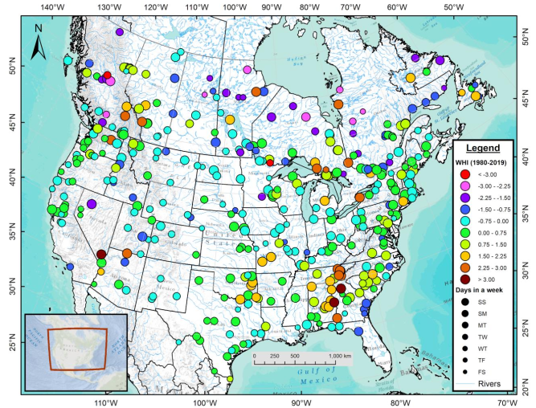 

 Dery et al. 2021 

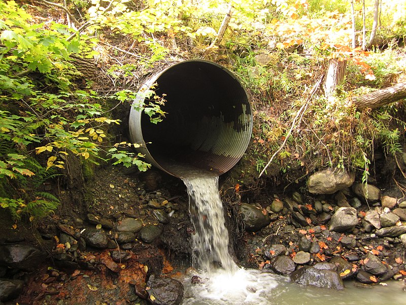 
---
# Climate change
## Changes in precipitation and temperature
- Change in precipitation types, frequency & intensities (magnitude and duration) $\rightarrow$ Complicated
- Increased droughts resulting in the loss of the "fill and spill" of potholes $\rightarrow$ Decreased connectivity

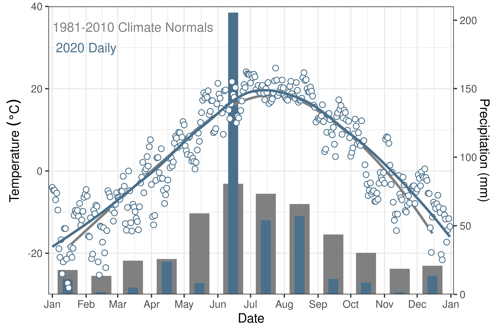 
---
# Climate change
## Wildfire
- Decreases in evapotranspiration and infiltration, and increase in soil hydrophobicity $\rightarrow$ Changes in the amount and timing of runoff and sediment and chemical fluxes

## Cryosphere
- Receding glaciers $\rightarrow$ Complicated
    - River piracy $\rightarrow$ Reconfiguration in connectivity
    - Faster rates of melting $\rightarrow$ Increased connectivity
    - Smaller/disappearing glaciers $\rightarrow$ Decreased connectivity
- Permafrost degradation $\rightarrow$   Shift from overland to subsurface flows   
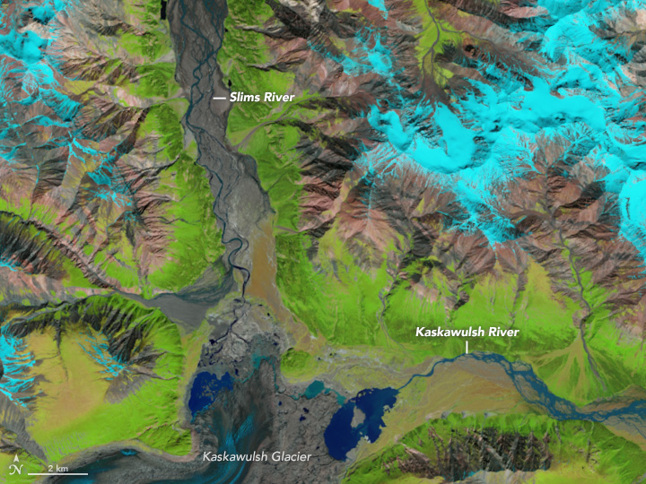 

---
# Regional challenges
## Geography matters
- Urban vs rural
- Forested vs prairies
- North vs south
- Resource development
- Climate change
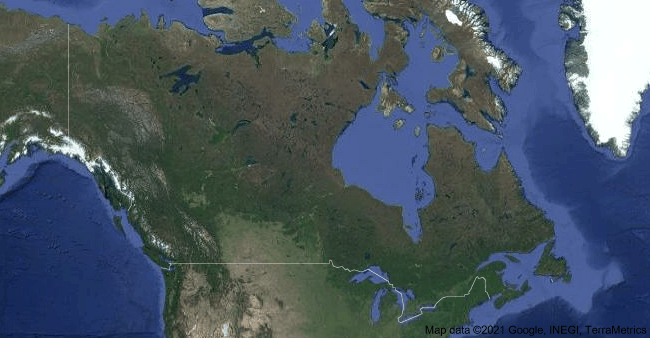 
---
# Impacts on water resources
- Water security (access, quantity, quality)
- Indigenous traditional territories
- Power production and industrial development
- Aquatic ecosystems

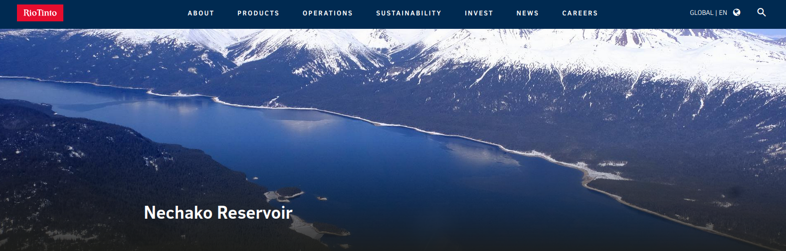 
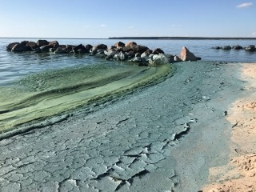 

---
# Addressing issues of connectivity
## Mitigation
- Limit fragmentation of landscapes and watersheds (roads, pipelines)
- Limit the number of dams and structures and/or better design
- Land management (cover cropping, riparian buffers) 
- Multiple stressors $\rightarrow$ cumulative impacts
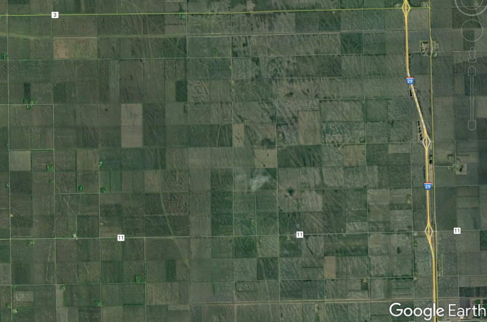 
---
# Addressing issues of connectivity
## Need to consider measures that are relevant to the specific landscape/region
- Sometimes **increasing** connectivity is a good thing
- Sometimes **decreasing** connectivity is a good thing
- Sometimes increasing connectivity in some areas **and** decreasing it in others is a good thing 
- Sometimes changing connectivity is both a **good and bad** thing
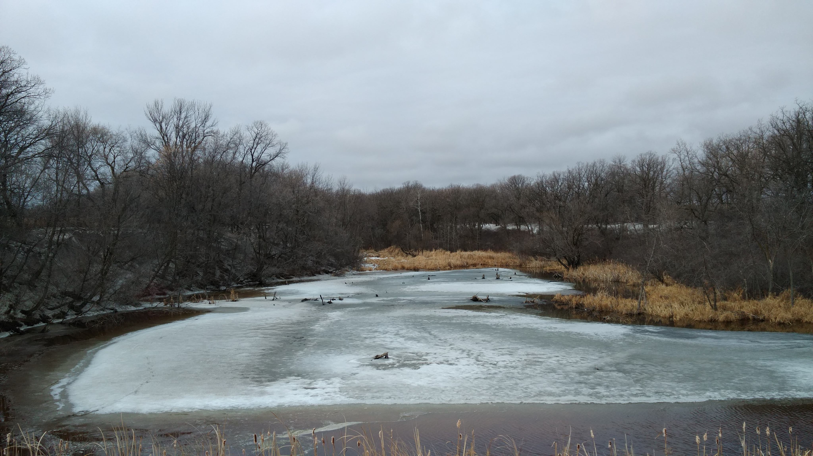 

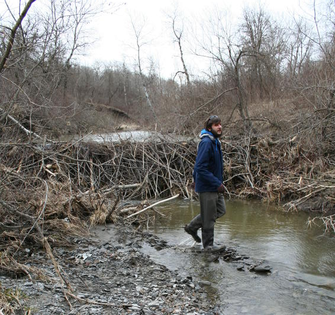 
---
# Thank You
## Need to consider measures that are relevant to the specific landscape/region
- Sometimes **increasing** connectivity is a good thing
- Sometimes **decreasing** connectivity is a good thing
- Sometimes increasing connectivity in some areas **and** decreasing it in others is a good thing 
- Sometimes changing connectivity is both a **good and bad** thing

.align-bottom-left[  @Alex_Koiter  alex-koiter  alexkoiter.ca  koitera@brandonu.ca]

