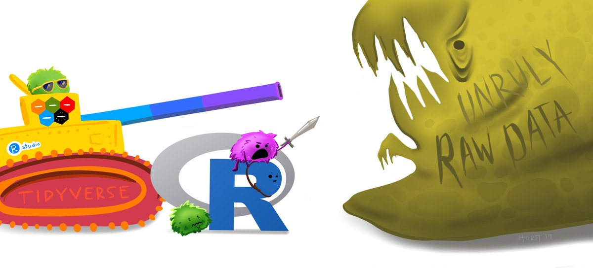
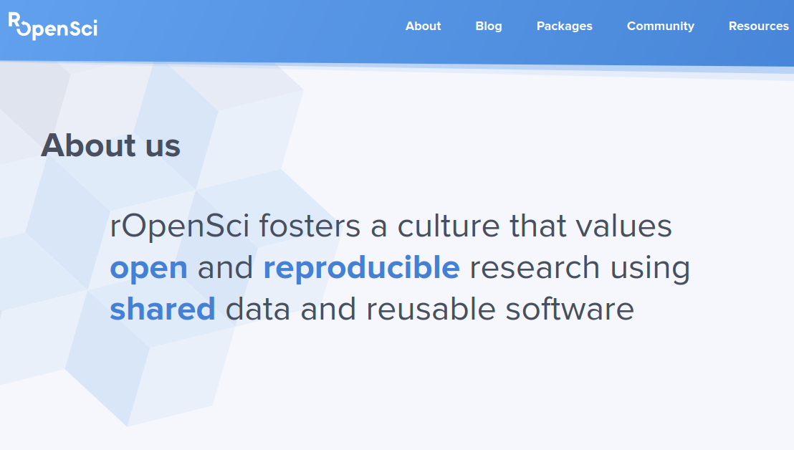
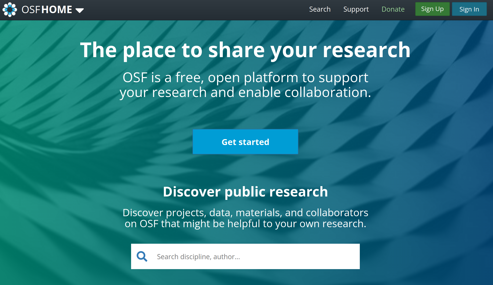
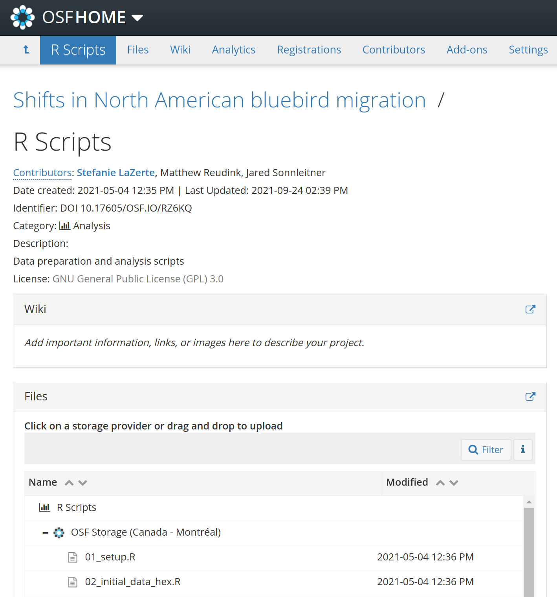

class: title-slide, nobar

```{r setup, include = FALSE}
library(icons)
library(stringr)
library(glue)

knitr::opts_chunk$set(fig.width = 6, fig.asp = 0.5, out.width = "100%", 
                      dpi = 250, fig.align = "center",
                      echo = FALSE, message = FALSE,
                      cache = TRUE)

# Use title as alt text for icons
icon2 <- function(icon, title, icon_fun = ionicons) {
  icon <- icon_fun(icon)
  icon <- as.character(icon)
  if(str_detect(icon, "<title>")) {
    str_replace(icon, "<title></title>", glue("<title>{title}</title>")) %>%
      icons:::add_class("icon")
  } else {
    str_replace(icon, 
                "(http://www.w3.org/2000/svg\">\n )", 
                glue("\\1<title>{title}</title>")) %>% 
      icons:::add_class("icon")
  }
}

```


<div style = "position: absolute; right:15px; bottom:45px; font-size: 75%">Artwork by <a href = "https://twitter.com/allison_horst">Allison Horst</a></div>

<div style = "position: absolute; right:15px; bottom:15px; line-height: 1; font-size: 50%;">
Updated from Grolemund & Wickham's classis R4DS schematic,<br>envisioned by Dr. Julia Lowndes for her 2019 useR! keynote talk
</div>

### PCAG 2021
# **Importance of reproducible data analysis in<br>physical geography**


.footnote[
### Alex Koiter & Steffi LaZerte
]


---
# Introduction

## Reproducibility
- The data analysis can be successfully reproduced

## Replicability
- A separate investigator conducted an independent study and came to the same conclusion as the original study


---
class: split-40

# Reproducibility

- Less about ensuring the correctness of the results
- More about being transparent and understanding exactly what was done
    - This is especially important in large and complex datasets


.footnote[Artwork by [Allison Horst](https://twitter.com/allison_horst)]


.columnl[
.center[
## A study can be reproducible and still be wrong
]
]


---
# Computational reproducibility
## Important because:
- Allows us to evaluate the data, analyses, and models on which conclusions are drawn
- Allows you to revisit your own work (e.g., incorporate a suggestion)

## It is difficult to reproduce because:
- Data is not made available
- Method sections of papers often do not provide enough detail
- Use of graphical programs (clicks and drop down menus)
- Not making code available (R, Python, MATLAB)

---
# Working with large data sets
## Data aquisition 
- Documenting getting/downloading/importing data sets
    - Always maintain the original data (unmodified)
    
---
# Working with large data sets 
## Data munging/wrangling   
1. Formatting
2. Merging
3. Quality assurance
    - NA's
    - 0's
    - Detection limits
    - Outliers
    - Typos/errors   
    
### Need to document every change you make
### Easy with small data sets with and simple structure



.footnote[Artwork by [Allison Horst](https://twitter.com/allison_horst)]


---
class: split-40
# Working with large data sets 
## Data analysis
- Analysis/figures
    - Data used
    - Analysis used (trial and error)
    - Parameters
    - Diagnostics
    - Figure creation process
    - Software versions


.footnote[Artwork by [Allison Horst](https://twitter.com/allison_horst)]


.columnl[
.center[
## Hard to write papers if you<br>don't keep track of this!
]]

---
class: space-list

# Why is this not practiced?

- Don't know how
- Too busy 
- It's internal work
- Worried about being copied
- Rigged the data


---
class: space-list

# Why is this not practiced?

- Don't know how - **learn! lots of support and tools available**
- Too busy - **often faster in the long run**
- It's internal work - **often a need to share**
- Worried about being copied - **in practice low risk**
- Rigged the data - **you have bigger problems**


![:img right: 5px, bottom: 5px, 45%, A person in a cape that reads 'code hero' who looks like they are flying through the air while typing on a computer while saying 'I’m doing a think all on my own!' The coder’s arms and legs have ropes attached to two hot air balloons lifting them up&comma; with labels on the balloons including 'teachers'&comma; 'bloggers'&comma; 'friends'&comma; 'developers'. Below the code hero&comma; several people carry a trampoline with labels 'support' and 'community' that will catch them if they fall](./figs/code_hero.jpg)

.footnote[Artwork by [Allison Horst](https://twitter.com/allison_horst)]


---
# How can you achieve this?

## Keeping track
- Extensive notes
  - What, when, with what
- Programmatically
  - Scripts, R, Python, MATLAB, etc.
- Version control
  - git, [GitHub](https://github.com), [GitLab](https://gitlab.com)
  
## Sharing
- Open Science!
  - [GitHub](https://github.com), [GitLab](https://gitlab.com), etc.
  - [Open Science Framework](https://osf.io) (OSF)
- Journal Supplementary materials





---
# What do we use?

## R
- Statistical programming language
- Free and open source

### Want to learn?

  - [rOpenSci](https://ropensci.org) organization
  - [R for Data Science](https://r4ds.had.co.nz/) online book
  - [RStudio Primers](https://rstudio.cloud/learn/primers) interactive online exercises
  - Attend classes or workshops 
    - Like one of Steffi's [Introduction to R](https://steffilazerte.ca/BU2021) workshops<br>(shameless self-promotion)

![:img right: 5px, bottom: 35px, 40%, A digital cartoon with two illustrations: the top shows the R-logo with a scary face&comma; and a small scared little fuzzy monster holding up a white flag in surrender while under a dark stormcloud. The text above says 'at first I was like...' The lower cartoon is a friendly&comma; smiling R-logo jumping up to give a happy fuzzy monster a high-five under a smiling sun and next to colorful flowers. The text above the bottom illustration reads 'but now it’s like...'](./figs/r_first_then.png)

.footnote[Artwork by [Allison Horst](https://twitter.com/allison_horst)]


---
class: split-50

# What do we use?

## git & GitHub

.columnl[
- **git** is a version control system
  - keeps tracks of changes
- [**GitHub**](https://github.com) is an online home for git projects
  - allows collaboration and sharing
- like R, tricky to learn, but oh so powerful!


### Want to learn?

- [Happy Git with R](https://happygitwithr.com/) online book
]


---
# What do we use?

## [Open Science Framework](https://osf.io)




---
class: split-50
# What do we use?

## [Open Science Framework](https://osf.io)

- Can integrate with GitHub, Dropbox, Zotero, etc.
- Use as Dropbox-like storage and sharing
    - Drag and drop!
- Make parts private or public
- Create DOIs for referencing in publications




.columnl[
.center[
## Great way to get your feet wet!
]]

---
# Making science stronger

- Peer review is difficult if we don't know how things were done
- Mistakes happen
    - Can only be fixed if found
    - This is not a sign of weakness - hiding or not learning from them is
- Reducing the need to reinvent the wheel for similar projects/analysis
    - Easier to build upon previous work
- Accessibility

--


.center[
### Thank you!
]


.footnote[
.small[

`r icon2('logo-twitter', 'Twitter')` @Alex_Koiter&nbsp;  | `r icon2('logo-github', 'GitHub')` alex-koiter&nbsp;&nbsp;   | `r icon2('globe-outline', 'World wide web')` alexkoiter.ca<br>`r icon2('logo-twitter', 'Twitter')` @steffilazerte | `r icon2('logo-github', 'GitHub')` steffilazerte | `r icon2('globe-outline', 'World wide web')` steffilazerte.ca<br>
Slides: <https://github.com/alex-koiter/presentations> ([PDF](https://raw.githubusercontent.com/alex-koiter/presentations/main/PCAG/Repro/Reproducibility.pdf))  
Created with the R package [xaringan](https://github.com/yihui/xaringan), using [remark.js](https://remarkjs.com), [knitr](http://yihui.name/knitr), and [R Markdown](https://rmarkdown.rstudio.com)<br>
Icons from [Ionicons](https://ionic.io/ionicons); Compiled on `r Sys.Date()`]]
