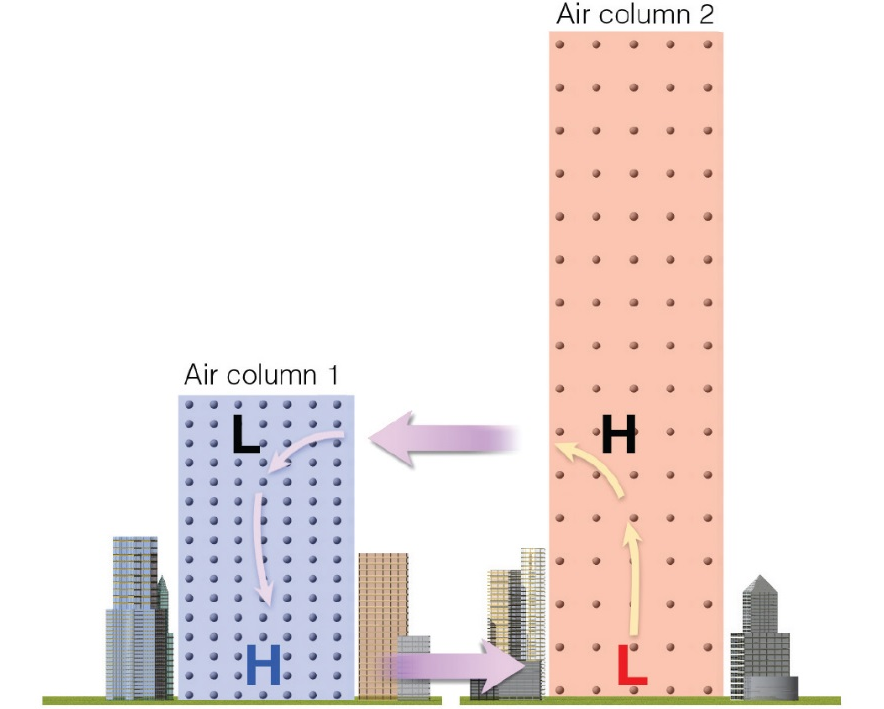
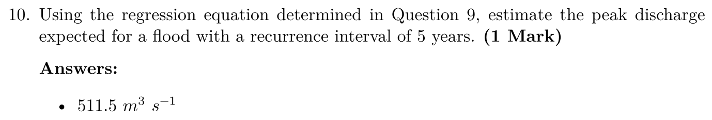
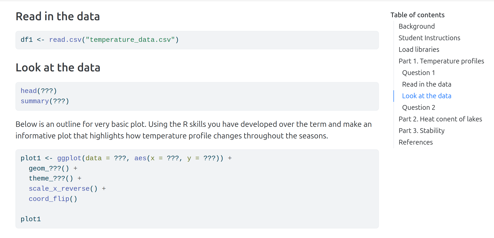
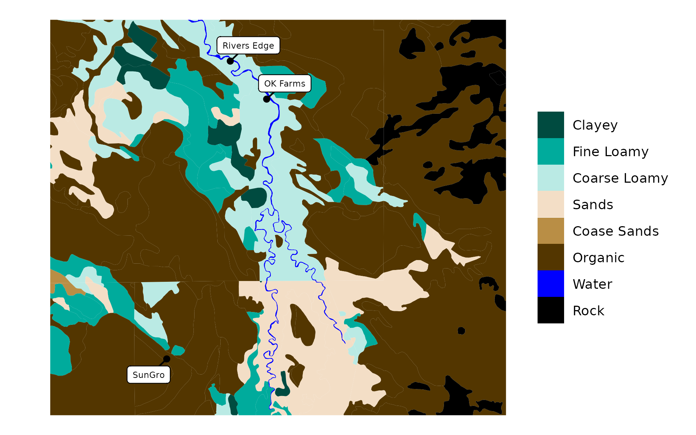
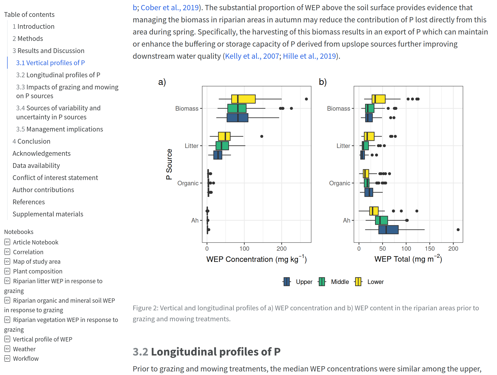

```{r setup, include = FALSE}
library(tidyverse)
library(lubridate)
library(scales)
library(tidyhydat)
```

## What is Quarto?

### An open-source scientific and technical publishing system [(quarto.org)](https://quarto.org/)
:::{.fragment}
::: {.callout-note icon=false}

## What does that even mean?

:::
:::

:::{.fragment}

- A plain-text file where you:
  - Write content
  - Add code for data analysis and visualizations
  - Include instructions for formatting
:::

:::{.fragment}
::: {.callout-note icon=false}

## Lets look at some simple examples

:::
:::

## What is Quarto?{.nostretch}
### Markdown
 
- A text markup language

<p>

:::: {.columns}

::: {.column width="60%"}

[**For example, the following...**]{.spacer}

```{md, eval = FALSE, echo = TRUE}
### My heading

**Hi!** This is in *italics*

A [link](https://alexkoiter.ca/) to my website

```
:::

::: {.column width="40%"}

[**Becomes...**]{.spacer}

### My heading

**Hi!** This is in *italics*

A [link](https://alexkoiter.ca/) to my website
:::

::::

## What is Quarto?
### R
 
- A programming language
  - Primarily for data manipulation, statistics, and visualization
<p>

:::: {.columns}

::: {.column width="60%"}

[**For example, the following...**]{.spacer}

```{md, eval = FALSE, echo = TRUE}
### Fuel Efficiency

library(ggplot2)
ggplot(data = mtcars, aes(x = disp, y = mpg)) +
  geom_point() +
  stat_smooth(method = "lm", se = FALSE) +
  theme_bw() +
  labs( x = "Engine displacement (cu.in)")

```
:::

::: {.column width="40%"}

[**Becomes...**]{.spacer}

### Fuel Efficency
```{r}
library(ggplot2)
ggplot(data = mtcars, aes(x = disp, y = mpg)) +
  geom_point() +
  stat_smooth(method = "lm", se = FALSE) +
  theme_bw() +
  labs( x = "Engine displacement (cu.in)")
```


:::

::::


## What is Quarto?

### R Markdown, Quarto, knitr, and Pandoc
- R Markdown(.Rmd) and Quarto (.qmd) files are a mix of Markdown and R code
- knitr is an R package which evaluates R code and returns the output as a Markdown file
- Pandoc is a separate (independent) program that converts Markdown to a variety of formats


## Why use quarto?
- Free to use and open
- Reproducible and easy to update
- Easy to incorporate R code, output, and visualizations
- Can produce a [wide range of document types](https://quarto.org/docs/output-formats/all-formats.html)
  - html
  - pdf
  - docx
  - pptx

## Lectures - Standard
```{md, eval = FALSE, echo = TRUE}
## Lectures - Standard
::::{columns}
:::{.column}
- Heating and cooling of air columns cause horizontal pressure variations 
    - Aloft and at the surface
- Pressure gradient forces air to move from areas of high to areas of low pressure

:::
:::{.column}

:::
::::  
```

## Lectures - Standard

::::{columns}
:::{.column}
- Heating and cooling of air columns cause horizontal pressure variations 
    - Aloft and at the surface
- Pressure gradient forces air to move from areas of high to areas of low pressure

:::
:::{.column}

:::
:::: 

## Lectures - Math and equations
```{md, eval = FALSE, echo = TRUE}
## Lectures - Math and equations
- Stream bed sediment generally mobilize at flow velocities that exceed a critical shear stress $(\tau_{cr})$

::::{.columns}
:::{.column}
$$\Theta_{cr}=\frac{\tau_{cr}}{g(\rho_s-\rho_w)D}$$
:::

:::{.column}
$\rho_s$ = density of particle  
$\rho_w$ = density of water  
$g$ = acceleration of gravity  
$D$ = grain diameter  
$\Theta_{cr}$  = Shields parameter  
:::
::::

- Many streams are considered hydrodynamically rough and the Shields parameter is approximately 0.06 
```

## Lectures - Math and equations

- Stream bed sediment generally mobilize at flow velocities that exceed a critical shear stress $(\tau_{cr})$

::::{.columns}
:::{.column}
$$\Theta_{cr}=\frac{\tau_{cr}}{g(\rho_s-\rho_w)D}$$
:::

:::{.column}
$\rho_s$ = density of particle  
$\rho_w$ = density of water  
$g$ = acceleration of gravity  
$D$ = grain diameter  
$\Theta_{cr}$  = Shields parameter  
:::
::::

- Many streams are considered hydrodynamically rough and the Shields parameter is approximately 0.06 


## Lectures - Real data
```{md, eval = FALSE, echo = TRUE}
## Lectures - Real data
### Wilsons Creek Daily Flow

qd <- hy_daily_flows(station_number = "05LJ801") %>%
  mutate(dayofyear = yday(Date), Year = year(Date)) %>%
  mutate(dayofyear_formatted = as.Date(dayofyear - 1, origin = "2016-01-01")) %>%
  filter(Year < 1977, Year >1972)

    ggplot(data = qd, aes(x = dayofyear_formatted, y = Value)) +
    geom_line() +
    scale_x_date(date_labels = "%b") +
    labs(y = bquote("Discharge ("*m^3*s^-1*")"), x = "Day of year") +
    theme_minimal()+
    facet_wrap(~Year, scales = "free_y")

```

## Lectures - Real data
### Wilsons Creek Daily Flow
```{r, fig.cap = "Water Survey of Canada"}

qd <- hy_daily_flows(station_number = "05LJ801") %>%
  mutate(dayofyear = yday(Date), Year = year(Date)) %>%
  mutate(dayofyear_formatted = as.Date(dayofyear - 1, origin = "2016-01-01")) %>%
  filter(Year < 1977, Year >1972)

    ggplot(data = qd, aes(x = dayofyear_formatted, y = Value)) +
    geom_line() +
    scale_x_date(date_labels = "%b") +
    labs(y = bquote("Discharge ("*m^3*s^-1*")"), x = "Day of year") +
    theme_minimal()+
    facet_wrap(~Year, scales = "free_y")

```


## Lectures - Custom figures
```{md, eval = FALSE, echo = TRUE}
## Lectures - Custom figures
### Stokes law
- $u_s = \frac{\rho_p-\rho_fgr^2}{18\mu}$

temp <- data.frame (size = seq(0.001, 1, 0.001))

temp3 <- data.frame (value = c(40, 0.5, 40, 0.5, 40, 0.5), size = c(0.001, 0.001, 0.01, 0.01, 0.4, 0.4), label = c("Clay", "Clay", "Silt", "Silt", "Sand", "Sand"), fluid = c("air", "water", "air", "water", "air", "water"))

temp2 <- temp %>%
  mutate(air = ((size/1000/2)^2)*2.96e8) %>%
  mutate(water = ((size/1000/2)^2)*3702222) %>%
  gather(key = fluid, value = value, air:water)

ggplot(temp2, aes(x = size, y = value)) +
  geom_line() +
  theme_bw() +
  scale_x_log10() +
  labs(x = "Grain size (mm)", y = "Settling Velocity (m/s)") +
  geom_vline(xintercept = 0.063) +
  geom_vline(xintercept = 0.002) +
  #annotate("text", label = "Clay", x = 0.001, y = 40, angle = 90) +
  geom_text(data = temp3, aes(x = size, y = value, label = label, angle = 90)) +
  facet_wrap(~fluid, scales="free_y" )

```

## Lectures - Custom figures

### Stokes law
- $u_s = \frac{\rho_p-\rho_fgr^2}{18\mu}$
    
    
```{r, fig.cap = "Stokes Law"}

temp <- data.frame (size = seq(0.001, 1, 0.001))

temp3 <- data.frame (value = c(40, 0.5, 40, 0.5, 40, 0.5), size = c(0.001, 0.001, 0.01, 0.01, 0.4, 0.4), label = c("Clay", "Clay", "Silt", "Silt", "Sand", "Sand"), fluid = c("air", "water", "air", "water", "air", "water"))

temp2 <- temp %>%
  mutate(air = ((size/1000/2)^2)*2.96e8) %>%
  mutate(water = ((size/1000/2)^2)*3702222) %>%
  gather(key = fluid, value = value, air:water)

ggplot(temp2, aes(x = size, y = value)) +
  geom_line() +
  theme_bw() +
  scale_x_log10() +
  labs(x = "Grain size (mm)", y = "Settling Velocity (m/s)") +
  geom_vline(xintercept = 0.063) +
  geom_vline(xintercept = 0.002) +
  #annotate("text", label = "Clay", x = 0.001, y = 40, angle = 90) +
  geom_text(data = temp3, aes(x = size, y = value, label = label, angle = 90)) +
  facet_wrap(~fluid, scales="free_y" )

```

## Assignments
- Keep real world data sets up to date

```{md, eval = FALSE, echo = TRUE}
df <- hy_daily_flows(station_number = "05MH001", start_date = "2014-06-30") %>%
  bind_rows( hy_daily_flows(station_number = "05MH013", start_date = "1995-01-01", end_date = "2014-06-30")) %>%
  mutate(year = year(Date)) %>%
  add_row(year = 2025, Value = 189) %>%
  filter(year >= max(year) - 24) %>%
  group_by(year, Parameter) %>%
  summarise(peak = max(Value, na.rm = T))  %>%
  ungroup() %>%
  mutate(peak = round(peak, 1)) %>%
  rename(Year = year, `Discharge ($m^3s^{-1}$)` = peak) %>%
  select(-Parameter) %>%
  mutate(Rank = "", `Return interval (yr)` = "", `Probability (\\%)` = "")
```

## Assignments
- Export data in a more student friendly form

```{md, eval = FALSE, echo = TRUE}
df %>%
  rename_with(~c("Year", "Discharge", "Rank", "Return interval", "Probability")) %>%
  write_xlsx(here("Table_2.xlsx"))
```

## Assignments
- Set assignment parameters at the top 
  - Automatically updates the information in the question
  - Prevents students from copying previous years work

```{r, eval = TRUE, echo = TRUE}
reg_depth <- 10
slope <- 12.5
water <- 1.5
cohesion <- 1300
friction <- 15
reg_dens <- 2250
water_dens <- 1000
gravity <- 9.8  
```

```{md, eval = TRUE, echo = TRUE}
Consider a $`r reg_depth` ~m$ thick mass of regolith sitting on top of a bedrock surface with a slope of $`r slope`^{\circ}$.
```


Consider a $`r reg_depth` ~m$ thick mass of regolith sitting on top of a bedrock surface with a slope of $`r slope`^{\circ}$.


## Assignments
- Assignment and answer key are created in the same `.qmd` file
  - Automatically updates as the data or parameters change

```{md, eval = FALSE, echo = TRUE}
10. Using the regression equation determined in Question 9, estimate the peak discharge expected for a flood with a recurrence interval of 5 years. **(1 Mark)**

{r eval=show_answers}
#| echo: false
#| warning: false
#| results: asis

predictions <- data.frame(question = c(10, 11),
                    Return_interval = c(5, 50))

predictions2 <- predict(lm1, newdata = predictions)
predictions3 <- predict(lm2, newdata = predictions)

cat("
    **Answers:** 
    - ", round(predictions2[1], 1), "$m^3~s^{-1}$"
)
```

## Assignments
- Assignment and answer key are created in the same `.qmd` file

```{md, eval = FALSE, echo = TRUE}
quarto::quarto_render("Exercise 1 dev.qmd", execute_params = list(show_answers = "yes"), output_file = "Exercise-1_answer_key.pdf")

quarto::quarto_render("Exercise 1 dev.qmd", execute_params = list(show_answers = "no"), output_file = "Exercise-1.pdf")
```



## R Tutorials
- Has table of contents
- Easy to cut-and-paste



## Tour booklets
- MB Soil Science [2024 summer tour](https://raw.githubusercontent.com/alex-koiter/2024-MSSS-Tour/main/Booklet.pdf)
- Created the maps within the same document
- Integrates nicely with [GitHub](https://github.com/alex-koiter/2024-MSSS-Tour/tree/main)

{width=40%}

## Scientific publishing{.nostretch}
- Quarto manuscripts: text, data, analysis, code etc all in one place!
- Recent publication on riparian phosphorus [Website](https://alexkoiter.ca/riparian-grazing-manuscript/) [GitHub](https://github.com/alex-koiter/riparian-grazing-manuscript)

{width=50%}

## Resources  {.nostretch}


### Online References

- **Quarto**
  - [Quarto Documentation](https://quarto.org)
  - [Openscapes' Quarto Tutorial](https://openscapes.github.io/quarto-website-tutorial/)
  - [Posit's Welcome to Quarto Workshop!](https://www.youtube.com/watch?v=yvi5uXQMvu4) [(video)]{.small}
  - [We don't talk about Quarto](https://www.apreshill.com/blog/2022-04-we-dont-talk-about-quarto/)  [(blog post)]{.small}
  - [A Quarto tip a day](https://mine-cetinkaya-rundel.github.io/quarto-tip-a-day/) [(blog)]{.small}
- **R Markdown**
  - [R Markdown Documentation](https://rmarkdown.rstudio.com/)
  - [R Markdown: The Definitive Guide](https://bookdown.org/yihui/rmarkdown/)  [(online book)]{.small}
  - RStudio > Help > Cheat Sheets > R Markdown Cheat Sheet
  - RStudio > Help > Cheat Sheets > R Markdown Reference Guide


## Building teaching materials with Quarto

::: {.absolute bottom="100" left="600" width="150%"}

[**Want to learn more?**]{style="color:#094218;"}


:::
```{r, eval=FALSE}

code <- qrcode::qr_code("http://alexkoiter.ca/presentations/Quarto/Quarto.html")

qrcode::generate_svg(code, filename = here::here("./Quarto/figs/qr.svg"))

```


::: {style="position:absolute; bottom:20%"}
 `r icons::fontawesome("globe")` [**alexkoiter.ca**](https://alexkoiter.ca)<br> `r icons::fontawesome("envelope")` [**koitera\@brandonu.ca**](mailto:koitera@brandonu.ca)<br> `r icons::fontawesome("github")` [**alex-koiter**](https://github.com/alex-koiter)<br> `r fontawesome::fa("bluesky", fill = "black")` [**alex-koiter**](https://bsky.app/profile/alex-koiter.bsky.social)<br> `r icons::fontawesome("mastodon")` [**\@alex_koiter\@smstdn.ca**](https://mstdn.ca/@Alex_Koiter)<br> `r icons::fontawesome("linkedin")` [**Alex-Koiter**](https://www.linkedin.com/in/alex-koiter-43b04b2a8/)<br> `r icons::fontawesome("twitter")` [**\@alex_koiter**](https://twitter.com/alex_koiter)
:::

[*Slides created with [Quarto](https://quarto.org)*<br>Updated `r Sys.Date()`]{.small .absolute bottom="50"}
