# Who am I?

## About me
::: columns
::: {.column width="50%"}
- Brandon University
  - Department of Geography & Environment
- Teaching
  - Weather & climate
  - Geomorphology
  - Soil science

:::
    
::: {.column width="50%"}   


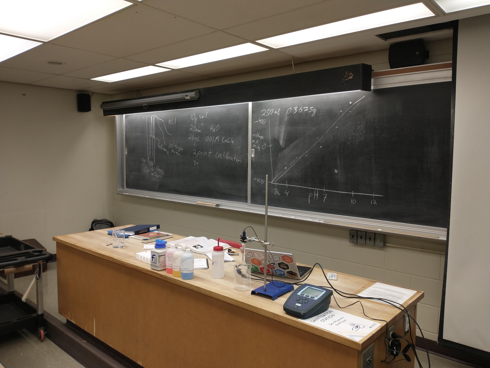{width=80%}    
:::
:::

## About me
::: columns
::: {.column width="50%"}
**Research interests**

- Agri-environmental issues
  - Soil carbon in treed areas
  - Nutrient runoff
  - Soil erosion
  - Microplastics

:::
    
::: {.column width="50%"}   
{width=70%}    
:::
:::

# What is pH?

## Acids and bases
- Measure of acidity or alkalinity
- Acids are substances that release hydrogen ions (H^+^)
- Bases are substances that release hydroxide ions (OH^-^)


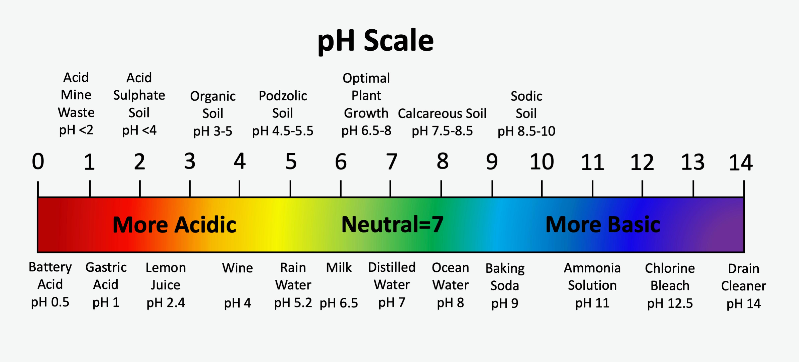{fig-align="center"}


## Etymology (origin of the word)
- Danish chemist Søren Sørensen introduced the term in 1909
- p $\rightarrow$ puissance (power or strength)
- H $\rightarrow$ hydrogène

- pH $\rightarrow$ puissance d'hydrogène (power of hydrogen)
    
  - There is debate on this interpretation

## pH scale

- The pH scale is built around pure water, which is neutral at 7
- Range from 0 (very acidic) to 14 (very basic)
  - These are practical boundaries, not absolute limits

{fig-align="center"}


# Why is pH important?

## Near neutral is best*
::::{columns}
:::{.column width="65%"}

- pH 6.0-7.5 considered optimum for most veggies and flowers

**Why?** 

- pH affects nutrient availability
  - Nutrients are in available forms
- pH affects metal availability
  - Low risk for metal toxicity
- pH can damage 
  - No damage to roots
  
:::
:::{.column width="35%"}
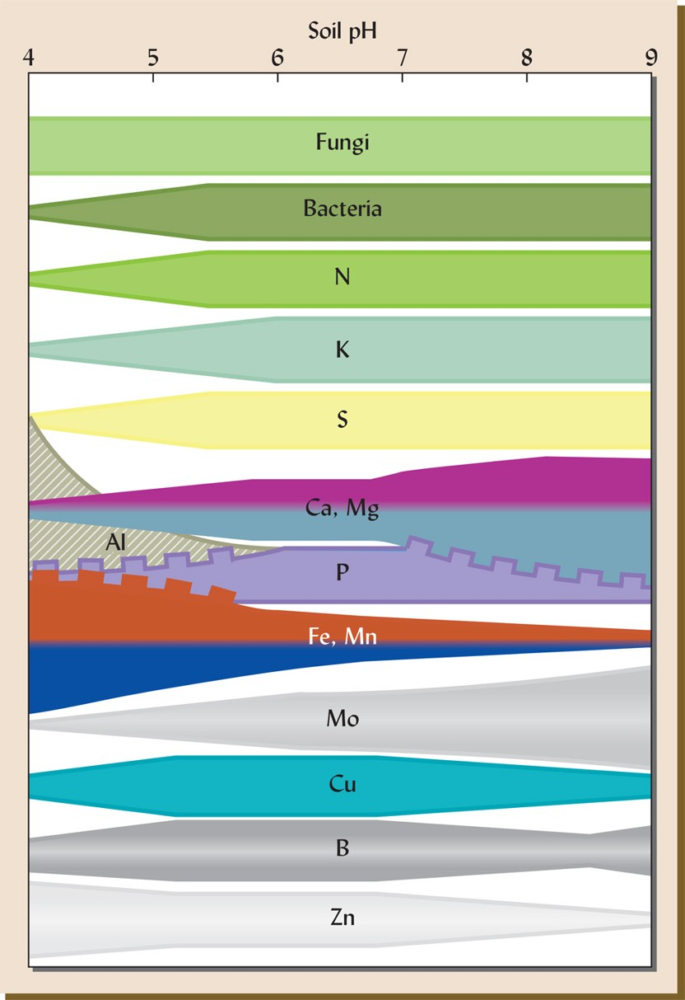{fig-align="center"}
:::
::::


## Tolerate vs. thrive
::::{columns}
:::{.column width="60%"}
- Different plants can tolerate or thrive at different pH
  - In natural systems you can often guess the soil pH based on what is growing
- Fertility levels will change this relationship
:::
:::{.column width="40%"}
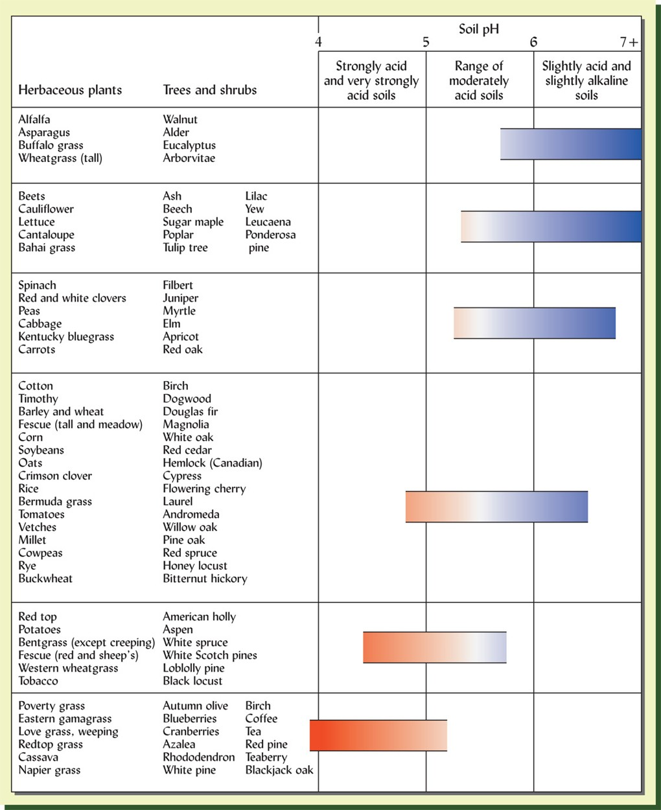{fig-align="center"}
:::
::::

## The extremes

### pH <5 (acidic)
- Toxicity of Aluminum and Manganese 
- Deficient in Calcium and Magnesium
- Phosphorus binds with Aluminum and Iron

### pH >8 (basic)
- Low amounts of Iron, Manganese, and Zinc
- Phosphorus binds with Calcium

## Plant and soil health
::::{columns}
:::{.column width="50%"}
- Impacts soil microbial activity and diversity
  - Many beneficial organisms have optimal pH ranges
- Impacts root growth
  - Stunted, shallow, poorly developed

:::

:::{.column width="50%"}
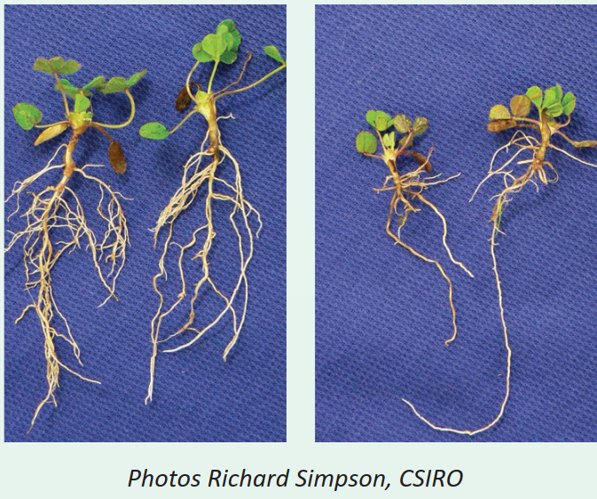{fig-align="center"}
:::
::::


# Putting it all together

## Blueberries (pH 4.5 - 5.5)
::::{columns}
:::{.column width="70%"}

- Tolerate aluminum and manganese
  - Roots exclude aluminum, sequester metals 

- Do not need much calcium
  - Too much can be problematic

:::
:::{.column width="30%"}
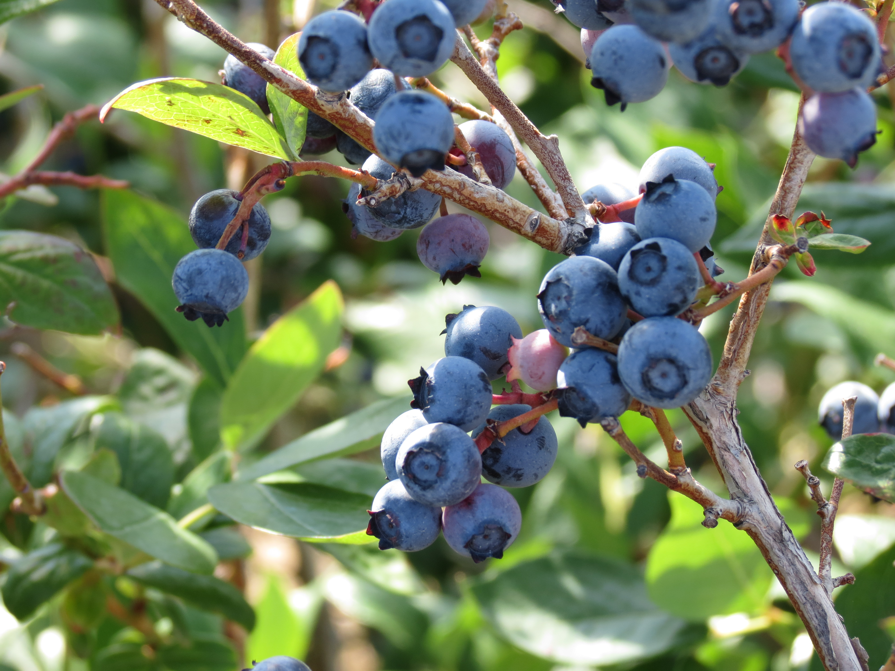{fig-align="center"}
:::
::::


## Blueberries (pH 4.5 - 5.5)
::::{columns}
:::{.column width="70%"}

- Good at taking up N as ammonium
  - More common form found at low pH
  - Most plants prefer nitrates found at neutral pH

- Ericoid mycorrhizal fungi 
  - Form symbiotic relationship
  - Well adapted to acidic soils

:::

:::{.column width="30%"}
{fig-align="center"}
:::
::::


# Causes of low pH (acid) soils

## Rainfall

- Rain is slightly acidic as CO~2~ from the atmosphere dissolves into the water

- $CO_2 + H_2O \rightarrow H_2CO_3$
- Carbon dioxide + water $\rightarrow$ Carbonic acid

## Rainfall

### Pollution

- Sulfur and nitrogen gases from combustion and other industrial sources
  - Combine with rain to produce sulfuric and nitric acid
  
{width="40%" fig-align="center"}


## Rainfall
::::{columns}
:::{.column width="50%"}
### Leaching
- In humid/tropical areas high rainfall leaches (removes) Ca^2+^, Mg^2+^, K^+^, Na^+^ from the soil
  - Leaves behind H^+^
:::
:::{.column width="50%"}
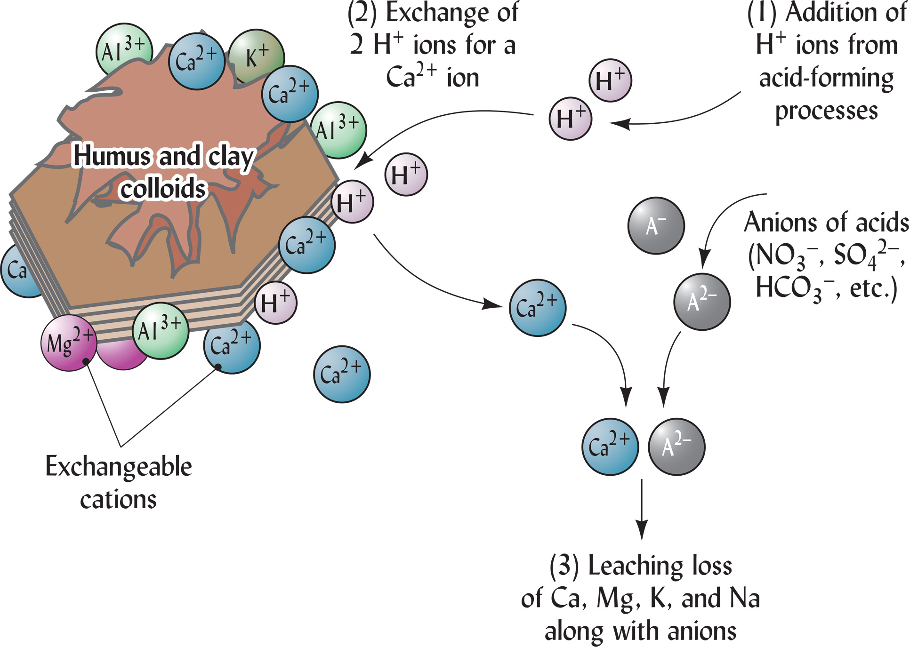{fig-align="center"}
:::
::::

## Organic matter
::::{columns}
:::{.column width="60%"}
- Decomposition generates acids (humic, fulvic, acetic, citric, oxalic)
  - Also generates CO~2~ producing more carbonic acid
- Accumulation of organic matter
  - Peatlands tend to be acidic
  
:::

:::{.column width="40%"}
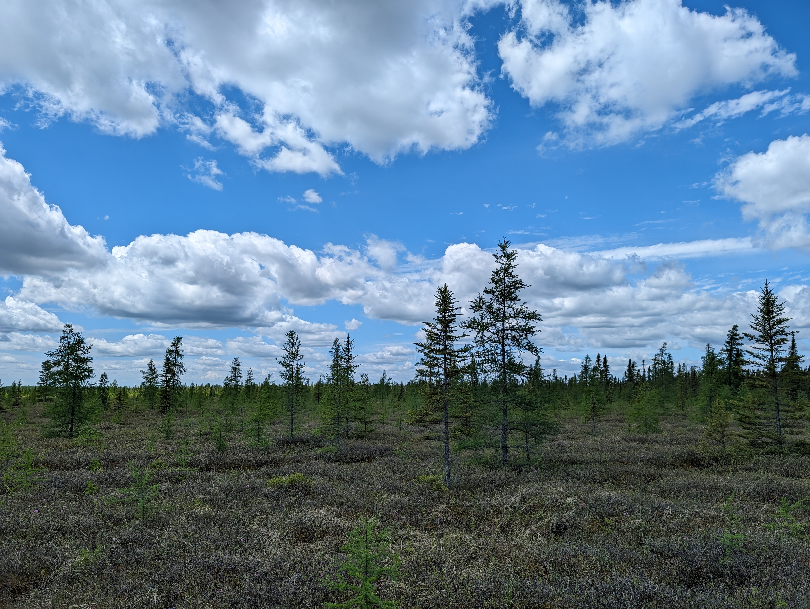{fig-align="center"}
:::
::::
## Oxidation of nitrogen and sulfur

::::{columns}
:::{.column width="80%"}
- Most garden soils have lots of Oxygen
- Sulfur
    - $FeS_2 + 3 \tfrac12 O_2+ H_2O \rightarrow FeSO_4 +H_2SO_4$
    - Pyrite + Oxygen $\rightarrow$ Ferrous sulfate + Sulfuric acid
    
- Nitrogen
    - $NH_3 + 2O_2 \rightarrow HNO_3 +  H_2O$
    - Ammonia + Oxygen $\rightarrow$ Nitric acid +  Water
    
:::
:::{.column width="20%"}

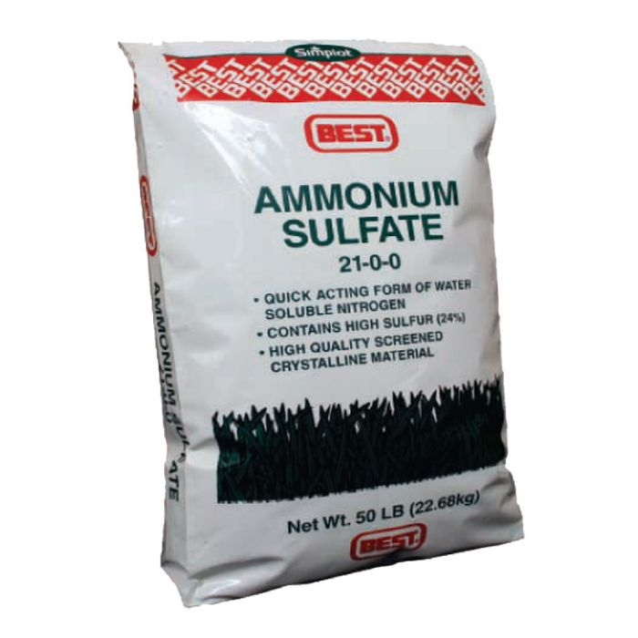    
:::
::::


## Plant uptake of nutrients
- As roots take up nutrients a balance in charge is maintained
  - Soil directly next to roots is often more acidic

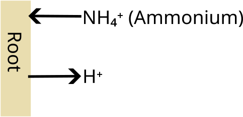{fig-align="center"}  

# Do Conifers acidify the soil?

## Coniferous trees
::::{columns}
:::{.column width="60%"}
- Needles are acidic when freshly fallen
- Nutrient uptake from soil
  - Very good at taking up Ca and Mg
  - H^+^ accumulates
- Effect is small 
:::

:::{.column width="40%"}
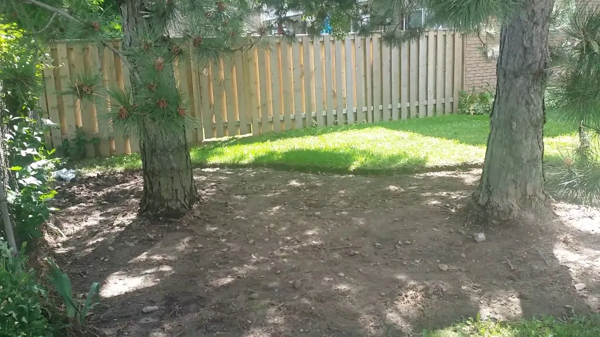{fig-align="center"}  
:::

::::
### Conifers grow well in acidic soil (adapted)

- Poor growth under conifers is more about light, moisture, and root competition

# Causes of high pH (basic) soils

## Rainfall
- Insufficient rain to leach (remove) Ca^2+^, Mg^2+^, K^+^, Na^+^ from the soil
  - These ions accumulate and keep the pH high

## Carbonates

e.g., Calcium carbonate (Limestone)  

```{style="margin-top: 20px"}
```

**1. Acid neutralization**

- $CaCO_3 + H^+ \rightarrow Ca^{2+} + H_2O + CO_2$
- Calcium carbonate + acid $\rightarrow$ Calcium  + Water + Carbon Dioxide


## Carbonates
e.g., Calcium carbonate (Limestone)  

```{style="margin-top: 20px"}
```

**2. Adding a base**

- $CaCO_3 + H_2O \rightarrow Ca^{2+} +HCO_3^- + OH^-$
- Calcium carbonate + acid $\rightarrow$ Calcium  + Bicarbonate + Hydroxide

# What do we have?

## Brandon soils
::::{columns}
:::{.column width="60%"}
- Surface: 6.5 - 7.8
- Subsurface: 7.4 - 8.4
:::
:::{.column width="40%"}
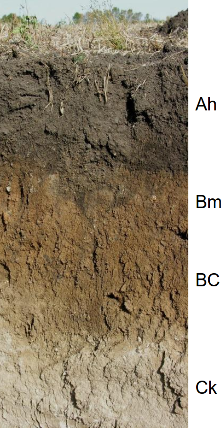{width=60% fig-align="center"}  
:::
::::


## Brandon soils
::::{columns}
:::{.column width="60%"}
- Parent material
  - Limestone-rich
- Semi-arid (moderate amount of rain)
  - Little leaching occurs


:::
:::{.column width="40%"}
{width=60% fig-align="center"} 
:::
::::


# Changing the pH

## Buffering capacity

- Most garden soils are well buffered
  - It can be hard to adjust the pH up **OR** down

- Carbonates neutralize added acids
- Clay and organic matter adsorb or release H^+^ 

## Buffering capacity

- Sandy soils with low organic matter and no carbonates: Poorly buffered
  - Easy to change the pH
  - Very sensitive to acidification
- Clay-rich soil with high organic matter, with carbonates: Well buffered
  - Difficult to change the pH
  - Protected against acidification
  
## Adjusting pH

**Lowering the pH**

- Elemental sulfur
- Aluminium sulfate (be careful)
- Peat moss (no lime)

**Increasing the pH**

- Carbonates
  - Lime (crushed limestone)
  - Dolomite (dolomitic lime)
  - Eggshells

  
## Adjusting pH

- Test $\rightarrow$ Amend $\rightarrow$ Wait $\rightarrow$ Retest
  - Takes time for sulfur to oxidize
  - Takes time for carbonates to work
- Because soils are buffered you may need to amend every few years


# Measuring pH

## How is pH measured?
### Mathematical definition

- pH = – log~10~ [H^+^]
  - One (1) unit of change in pH = 10 times change in H^+^ concentration
  - Half (0.5) unit of change in pH = ~3.16 times change in H^+^ concentration
- Not a linear scale!

## How is pH measured?

```{r}

library(ggplot2)
library(patchwork)
ph_data <- data.frame(
  pH = seq(0, 14, by = 0.1)
)

ph_data$H_conc <- 10^(-ph_data$pH)

# Plot
p1 <- ggplot(ph_data, aes(x = pH, y = H_conc)) +
  geom_line(color = "steelblue", linewidth = 1) +
  scale_y_log10(
    breaks = c(1e-14, 1e-12, 1e-10, 1e-8, 1e-6, 1e-4, 1e-2, 1),
    labels = c(expression(10^-14), expression(10^-12), expression(10^-10), expression(10^-8), 
             expression(10^-6), 
             expression(10^-4), 
             expression(10^-2), 
             expression(10^0)), expand = c(0,0)
  ) +
  scale_x_continuous(breaks = seq(0, 14, by = 2), expand = c(0,0)) +
  labs(
    title = "Logrithmic scale",
    x = "pH",
    y = expression("Concentarion of H"^"+"*" (mol L"^-1*")")
  ) +
  theme_bw(base_size = 14)

p2<- ggplot(ph_data, aes(x = pH, y = H_conc)) +
  geom_line(color = "steelblue", linewidth = 1) +
  scale_x_continuous(breaks = seq(0, 14, by = 2), expand = c(0,0)) +
  labs(
    title = "Linear scale",
    x = "pH",
    y = expression("Concentarion of H"^"+"*" (mol L"^-1*")")
  ) +
  theme_bw(base_size = 14)

p2 +p1
```

## Methods
::::{columns}
:::{.column width="60%"}

**1. Colorimetric**

- Dyes and test strips (litmus paper)
- Changes colour based on pH, compared against a chart
- Estimates within 0.1 to 0.2 pH units
- Measures pH in a soil-water mix
:::

:::{.column width="40%"}
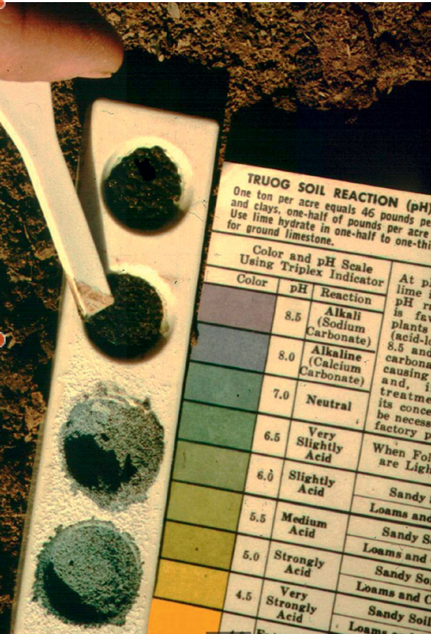{width=70%}  
:::
::::
## Methods
::::{columns}
:::{.column width="60%"}

**2. Glass-electrode**

- Direct measure of H^+^ concentration
- Estimates within <0.1 pH units
- Measures pH in a soil-water mix
:::

:::{.column width="40%"}
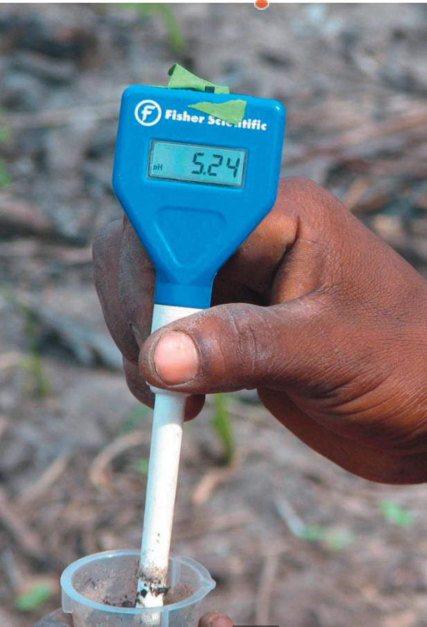{width=70%} 
:::
::::
## Methods
::::{columns}
:::{.column width="60%"}

**3. Metal probe**

- No scientific basis
  - Likely measuring soil moisture and conductivity ??? 
  - Its a guess at best
- I do **NOT** recommend
:::

:::{.column width="40%"}
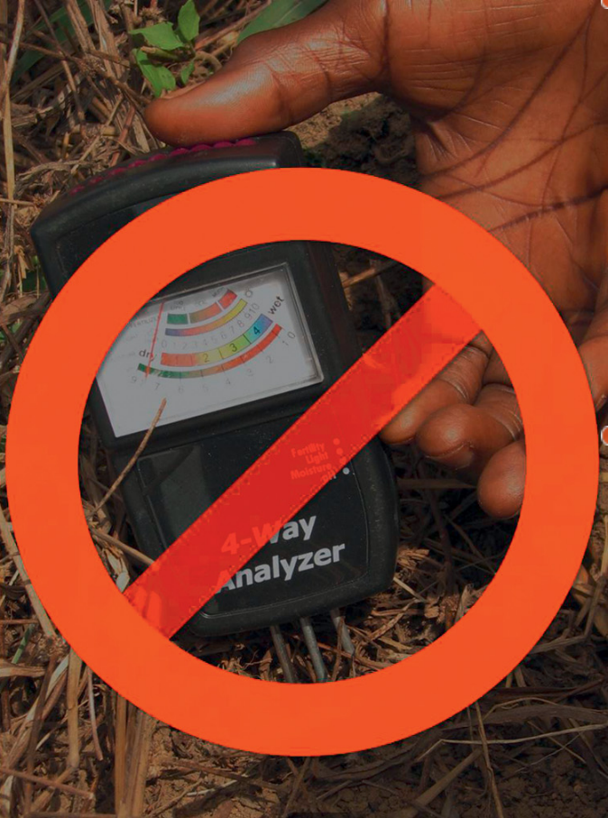{width=70%}  
:::
::::

## Lab Measurement
- Soil pH measurement is that of the solution in contact with the soil solids and not of the soil solids themselves
- Three common solutions
  - Pure water
  - Weak salt solution (0.01M CaCl~2~)
  - Strong salt solution (1.0M KCl)
- Ratio of soil to water is very important

## Lab Measurement

**Why add salt?**

- CaCl~2~ is not an acid or a base

- More stable reading
  - Less sensitive to soil conditions (moisture, fertilization, plant growth) that change over the growing season
  - Better for tracking change over time
- Typically get a measurement that 0.5 units lower than pure water
  - Salt will displace H^+^ from the soil and push it into the solution

# Lets get testing!

## Preparing the soil
::::{columns}
:::{.column width="60%"}

**Drying**

  - Moisture varies from day to day 

  - Mass of the solids only

**Sieving to <2mm** 

  - Remove stones (not soil)
  - Ensures a uniform sample

**Weighing**

  - 10g

:::  
:::{.column width="40%"}
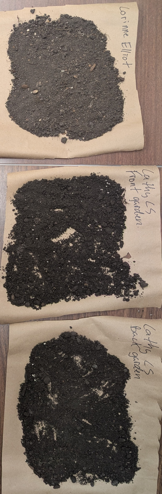  

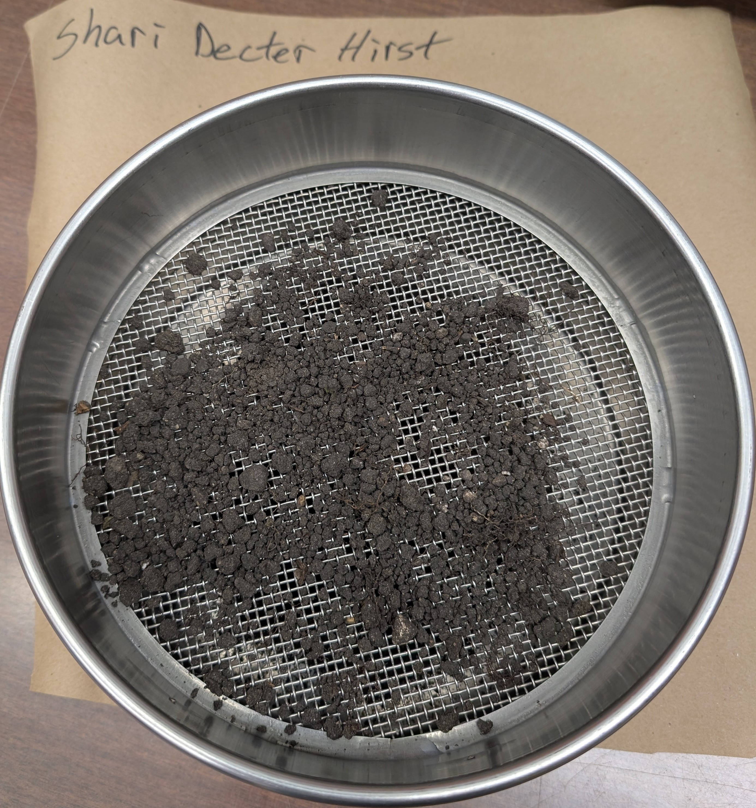{width=75%}  
:::
::::

## Preparing the solution
::::{columns}
:::{.column width="50%"}
- 1.47g dissolved in 1L of pure water
- 20mL per 10g of soil

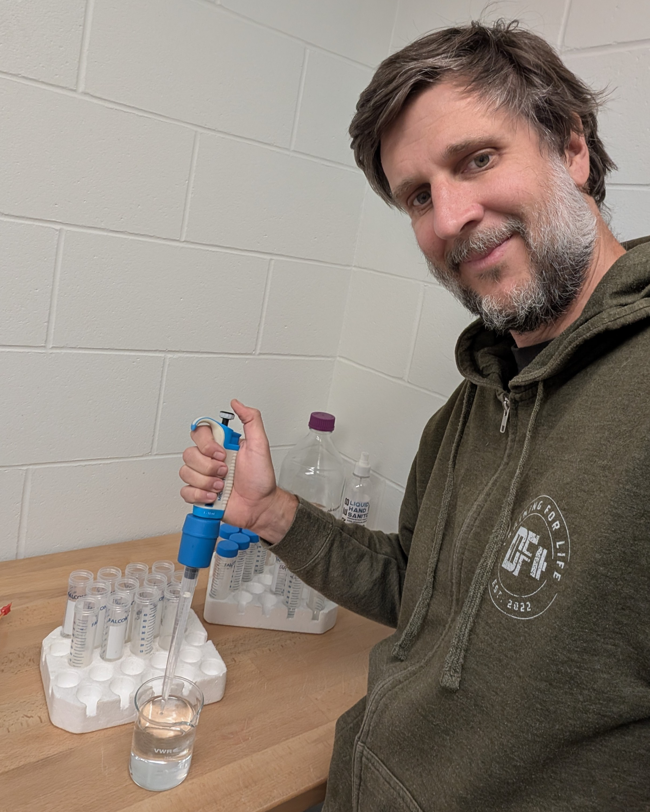{width=50%}  

:::
:::{.column width="50%"}
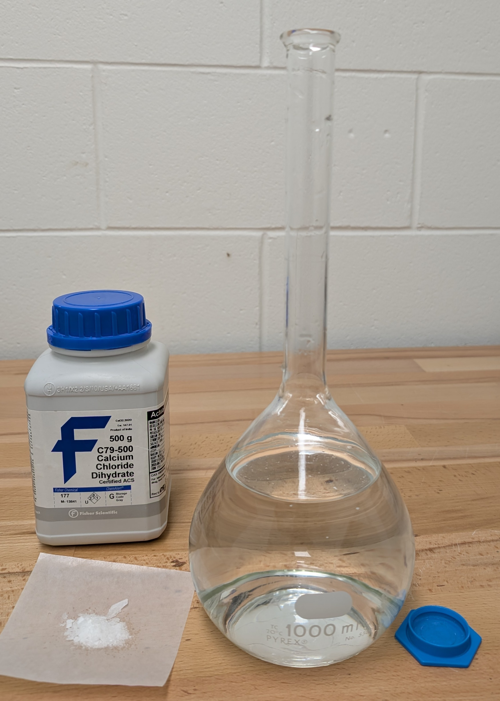{width=65%}    
:::
::::

## Stirring and waiting
- Stir/shake to ensure soil-solution is well mixed
- Wait for the solution to equalize
- Solids sink to bottom

  
## Taking the measurement
::::{columns}
:::{.column width="50%"}
- Calibrating the pH meter
  - Use two solutions of known pH (7 and 10)
- Electrode must be fully submerged
- Record the pH once the reading has stabilized
:::

:::{.column width="50%"}
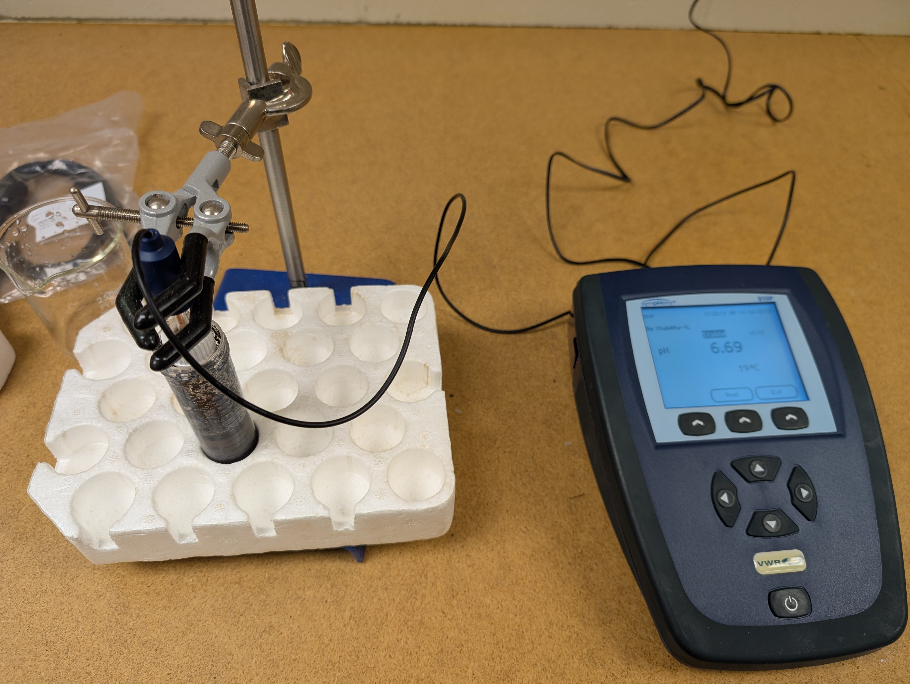  
:::
::::

## The Basics of Soil pH


### Thank you!


```{r, eval=FALSE}

code <- qrcode::qr_code("https://github.com/alex-koiter/presentations/Soil-pH")

qrcode::generate_svg(code, filename = here::here("./figs/L08/qr.svg"))


```

::::{columns}
:::{.column width="50%"}
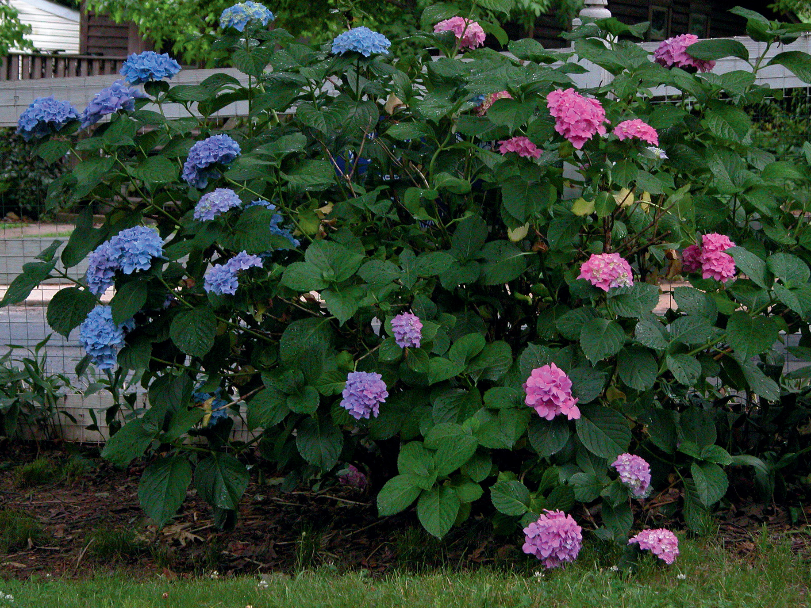
:::
:::{.column width="50%"}


:::
::::

# Extra

## Pools of acidity

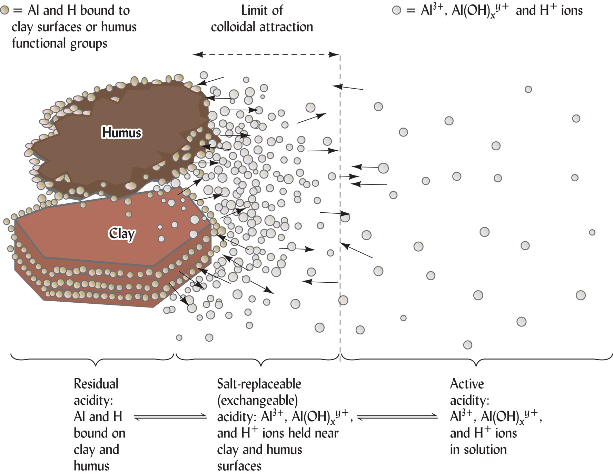{fig-align="center"}

