```{r setup, include = FALSE}
library(tidyverse)
library(mbquartR)
library(OpenStreetMap)
```

## What is a quarter section?
- Land unit measuring 160 acres (~64.8 ha), representing a quarter of a square mile
- Originates from the Dominion Land Survey system
  - European settlement and colonization of Western Canada
- Explains why most farms are square!

```{r}
#| cache: true
map <- openmap(c(50.046549, -99.938286), c(50.126981, -99.622064), zoom = NULL,
                  type = "esri-imagery", mergeTiles = TRUE) 
```

```{r}
#| fig-align: center
plot(map, raster=TRUE)
```

::: footer
ESRI imagery
:::

## What is a quarter section?
- A legal land description for a quarter section consists of four values separated by a "-"

::::{columns}
:::{.column}
  1. Quarter Section (SW)
  2. Section (9)
  
:::
:::{.column}
  3. Township (8)
  4. Range (6E1)
  
:::
::::

- **SW-9-8-6E1**: Southwest Quarter of Section 9, Township 8, Range 6 East of the 1st Meridian

::: {layout="[[1, -0.1, 1, -0.1, 0.8]]" layout-valign="top"}
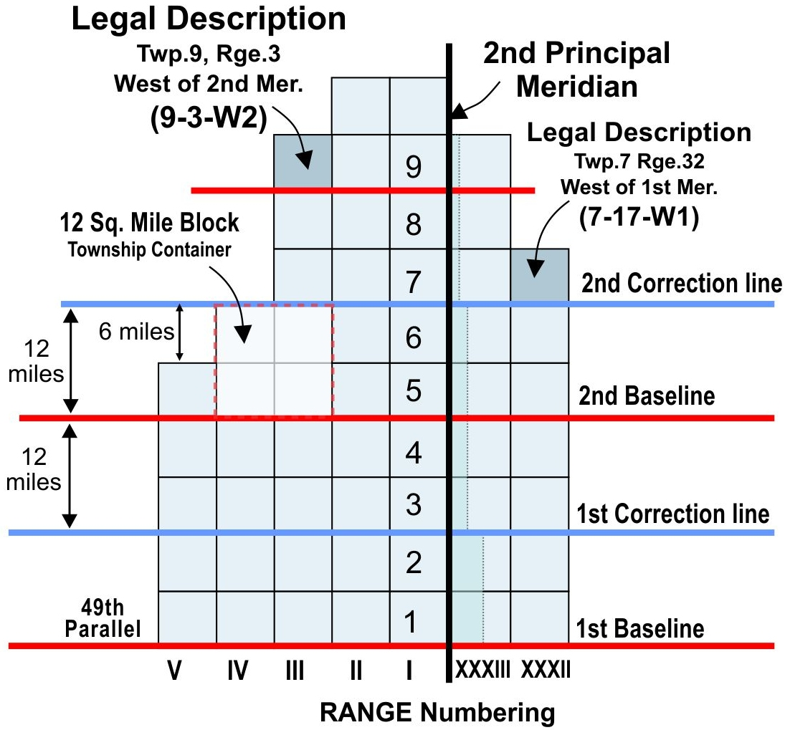{width="70%"}

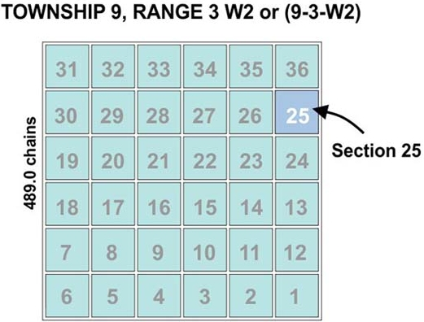{width="70%"}

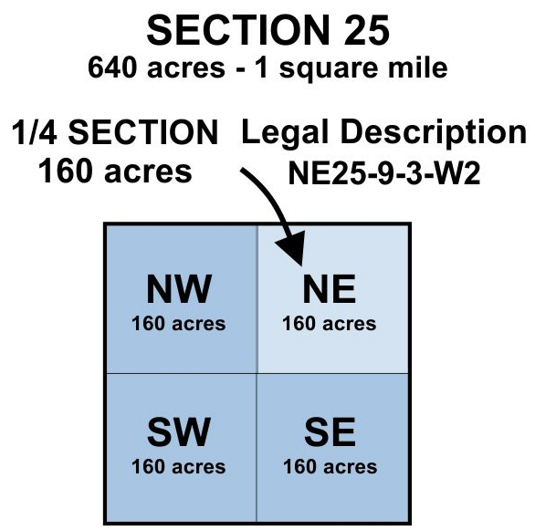{width="70%"}

:::

::: footer
[kalmakov.com](https://kalmakov.com/historical/dominion%20land%20survey.html)
:::

## Why are they used?
- Commonly used as a georeference before the widespread use of GPS
  - Archived samples and data
- Still commonly used in rural areas
  - A bit like a street address
  
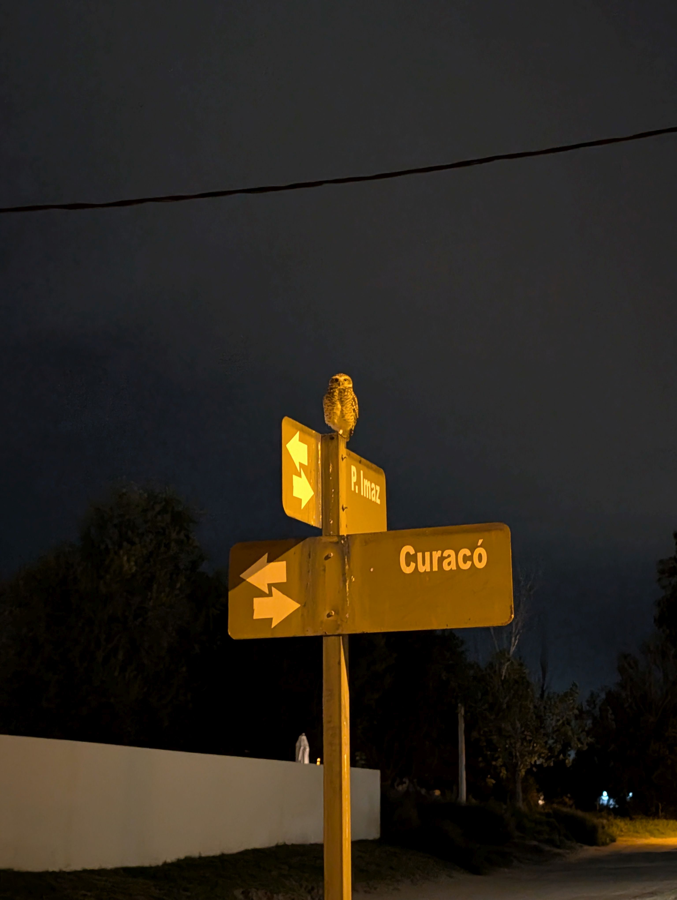{.absolute top="125px" right="50px" width="400px"}  

## Why are they difficult to use?
::::{columns}
:::{.column width="60%"}
- Lack of familiarity with the system
- Google Maps can't find SW-9-8-6E1 so I don't know how to get there!
- Online resources do exist to locate to help find them
  - Fee based
  - No batch processing
  - Do not provide coordinates
  - Can not search by coordinates
:::
:::{.column width="40%"}
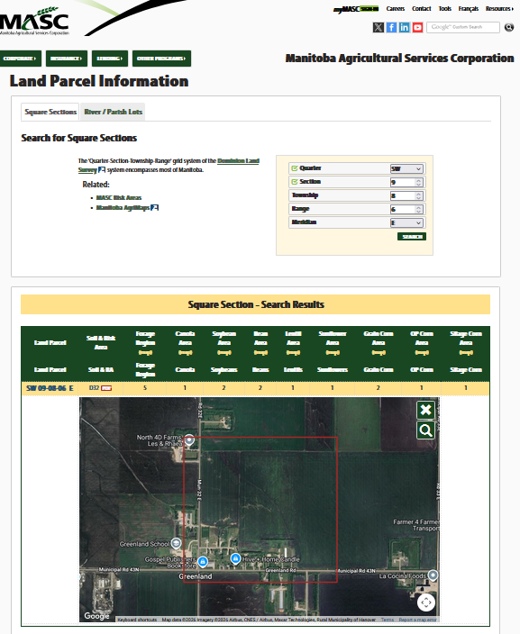{width="70%"}
:::
::::  


## How it all started

- An email

::: {.fragment}
::: {.callout-note icon=false}

## Dr. Steve Crittenden:

Hi Alex,

I need to locate coordinates for a bunch of quarter sections.

There must be an R package for this, right?

:::  
:::

::: {.fragment}
- But there wasn't! I was surprised and wanted to help
:::

## How it all started

- Data was publicly available through [Data MB](https://geoportal.gov.mb.ca/)

1. Wrote a script that downloaded the database and searched the database

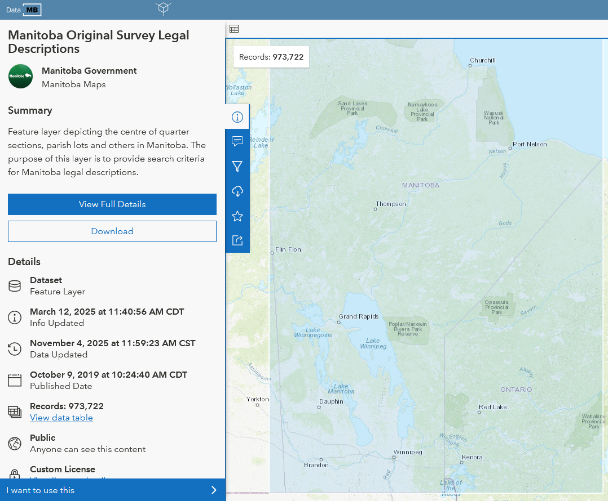{fig-align="center"}

## How it all started

::::{.columns}
:::{.column width="60%"}

- Data was publicly available through [Data MB](https://geoportal.gov.mb.ca/)

1. Wrote a script that downloaded the database and searched the database

2. Which turned into a series of functions

::: {.fragment}

3. Ultimately into an R package

:::
:::
:::{.column width="40%"}
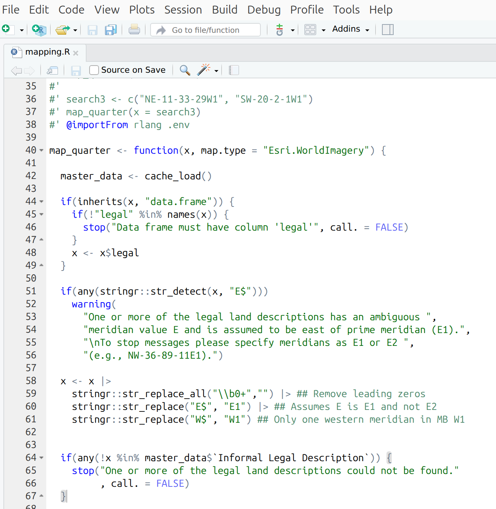{fig-align="center"}
:::
::::

## Why use mbquartR?

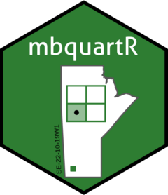{.absolute top="100px" right="50px" width="300px"}

### Free

- Free and open-source software (FOSS)

::: {.fragment}
### Fast and Easy

- One line of code to download data
- One line of code to search
- One line of code to map
:::

::: {.fragment}
### Integrate into R work flows

- Coordinates can be used to link multiple datasets
- Working with older archived soil samples or data
:::

## Why use mbquartR?
{.absolute top="100px" right="50px" width="300px"}


::::{columns}
:::{.column}
::: {.callout-warning icon=false}

## Reproducible!
- Scripts provide a record of actions
- Just note the `mbquartR` version 
  - `packageVersion(mbquartR)`
- Hard to document mouse clicks or website searches

::: 
:::
:::{.column}

:::
::::  


## mbquartR {.nostretch}
### Installing mbquartR

```{r}
#| eval: false
#| echo: true
install.packages("mbquartR", repos = "https://ropensci.r-universe.dev")
```


- Available through the R-universe

{fig-alin="center"}

## mbquartR
### Downloading the data

```{r}
#| eval: false
#| echo: true
quarters_dl()
```

- Downloads the data from Data MB
  - If website is not available it downloads an archived version
  - Data is not likely to change over time
  - More than **900,000** parcels of land!
  
{fig-align="center"}

## mbquartR
### Search by legal name

```{r}
#| echo: true
#| eval: false
#| warning: false
search_legal(x = c("NE-11-33-29W", "SW-20-2-1E"))
```

::: {.fragment}
### Output
```{r}
#| echo: false
#| warning: true
#| cache: true
search_legal(x = c("NE-11-33-29W", "SW-20-2-1E"))
```

:::
::: {.fragment}
- Spelling and order matters
- You can include leading zeroes (e.g., NE-01-012-12E1) or not (e.g., NE-1-12-12E1)
- Unless you specify it assumes you are using the E1 meridian not E2
:::

## mbquartR
### Search by coordinates

```{r}
#| echo: true
#| eval: false
#| warning: false
search_coord(long = c(-101.4656, -99.99768), lat = c(51.81913, 49.928926))
```

::: {.fragment}

### Output
```{r}

#| echo: false
#| cache: true
#| warning: true
search_coord(long = c(-101.4656, -99.99768), lat = c(51.81913, 49.928926))
```

:::

## mbquartR
### Mapping

```{r}
#| echo: true
#| warning: false
#| eval: false

map_quarter(x = c("NE-11-33-29W1", "SW-20-2-1W1"), map.type = "Esri.WorldImagery")
```


::: {.fragment}

### Output

::: {.cell layout-align="center"}

```{r}
#| echo: false
#| warning: true
#| cache: true
#| fig-width: 6
#| fig-height: 4
#| out-width: "50%"

map_quarter(x = c("NE-11-33-29W1", "SW-20-2-1W1"), map.type = "Esri.WorldImagery")
```

:::
:::

## mbquartR
### Documentation
- All functions have help documentation

```{r}
#| echo: true
#| warning: false
#| eval: false

?map_quarter()
```

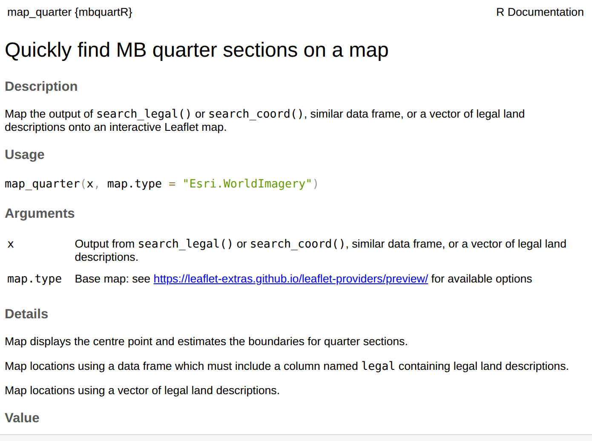{fig-align="center"}

## mbquartR
### Documentation
::::{.columns}
:::{.column width="40%"}
- [Website](https://docs.ropensci.org/mbquartR/index.html)
  - [Vingnettes](https://docs.ropensci.org/mbquartR/articles/mbquartR.html)
  - [Examples](https://docs.ropensci.org/mbquartR/articles/example.html)
:::
:::{.column width="60%"}
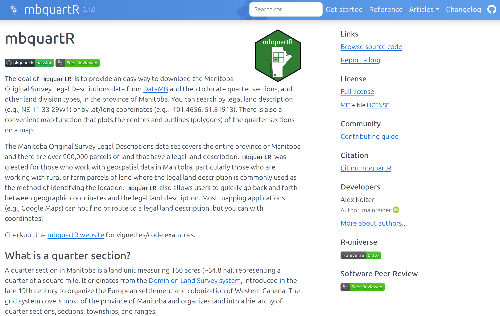{fig-align="center"}
:::
::::


## Package development

::::{columns}
:::{.column}
- Lots of great online resources
  - [R Packages (2e)](https://r-pkgs.org/)
  - [Happy Git and GitHub for the useR](https://happygitwithr.com/)
  - [rOpenSci Dev Guide](https://devguide.ropensci.org/)
- Fantastic developer tools/packages
  - [`usethis`](https://usethis.r-lib.org/) 
  - [`testthat`](https://testthat.r-lib.org/)
  - [`covr`](https://covr.r-lib.org/)
:::
:::{.column}
{width="60%"}
:::
::::  

## Package development

::::{.columns}
:::{.column width="65%"}
- Asked for lots of help along the way (thanks Steffi!)
- Looked at other examples (open source is awesome!)
- Tried really hard to break the package and anticipate unusual usage
- Helpful messages, warnings, and errors
- Useful package documentation
:::
:::{.column width="35%"}
](./figs/help_horst.png)
:::
::::

### I learned a lot throughout this process!

## rOpenSci Software Review

- The goal of the review is to improve the quality, reliability, and maintainability of scientific R packages
- Entire process is open and transparent ([my review](https://github.com/ropensci/software-review/issues/658))
- [Code of conduct](https://ropensci.org/code-of-conduct/) ensured a nice experience
- Pre-Submission Enquiry 
  - Avoids putting in the work only to get a desk rejection
- Easy to follow [guidelines](https://devguide.ropensci.org/)

{.absolute top="200px" right="50px" width="250px"}


## rOpenSci Software Review

{.absolute top="200px" right="50px" width="250px"}

- My reviewers had excellent suggestions
- I was able to have a back and forth conversation with the reviewers

- Blog post about my experience ([English](https://ropensci.org/blog/2025/03/25/r-package-review/) / [Español](https://ropensci.org/es/blog/2025/03/25/r-package-review/))

::: {.fragment}

- Once accepted, online code was transferred to rOpenSci
- I retain authorship and ownership
  - rOpenSci continues to provide support
:::


## Want to contribute?
::::{.columns}
:::{.column}
- Open an issue on the [mbquartR repository](https://github.com/ropensci/mbquartR)
  - Report a bug
  - Request a feature
  - Ask a question

:::
:::{.column}
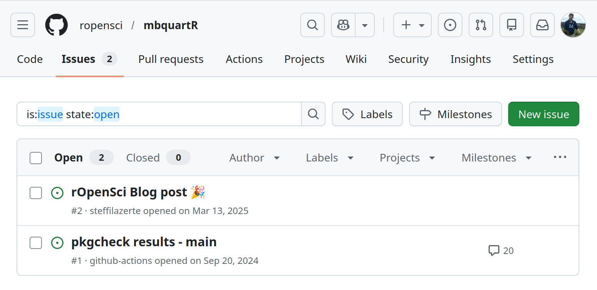
:::
::::

## Want to contribute?
::::{.columns}
:::{.column}
- Open an issue on the GitHub repository
  - Report a bug
  - Request a feature
  - Ask a question
- Read the [contributing guide](https://docs.ropensci.org/mbquartR/CONTRIBUTING.html)
  - Bug fixes
  - Feature implementation
:::
:::{.column}
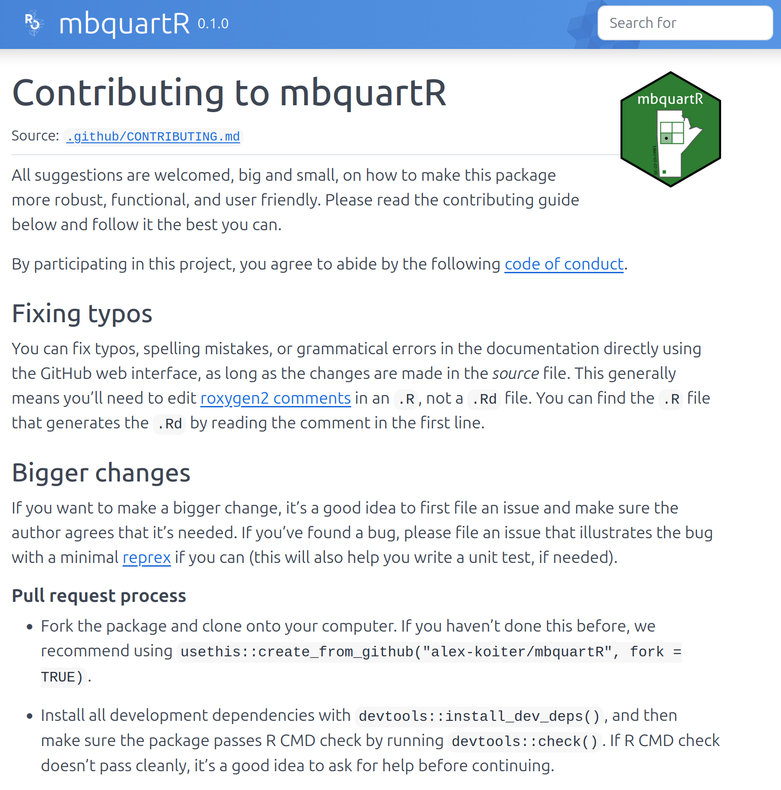
:::
::::


## mbquartR: Finding MB quarter sections made easier!

::: {.absolute bottom="100" left="475" style="display: flex; flex-direction: column; align-items: center;"}

[**Want to learn more?**]{style="color:#094218;"}


:::
```{r, eval=FALSE}

code <- qrcode::qr_code("https://github.com/alex-koiter/presentations/tree/main/mbquartR")

qrcode::generate_svg(code, filename = here::here("./mbquartR/figs/qr.svg"))


code2 <- qrcode::qr_code("https://docs.ropensci.org/mbquartR/")

qrcode::generate_svg(code2, filename = here::here("./mbquartR/figs/qr2.svg"))

```

{.absolute  bottom="150" right="50px" width="250px"}

    
::: {style="position:absolute; bottom:20%"}

 `r icons::fontawesome("globe")` [**alexkoiter.ca**](https://alexkoiter.ca)<br> `r icons::fontawesome("envelope")` [**koitera\@brandonu.ca**](mailto:koitera@brandonu.ca)<br> `r icons::fontawesome("github")` [**alex-koiter**](https://github.com/alex-koiter)<br>  [**alex-koiter**](https://bsky.app/profile/alex-koiter.bsky.social)<br> `r icons::fontawesome("mastodon")` [**\@alex_koiter\@mstdn.ca**](https://mstdn.ca/@Alex_Koiter)<br> `r icons::fontawesome("linkedin")` [**Alex-Koiter**](https://www.linkedin.com/in/alex-koiter-43b04b2a8/)<br> `r icons::fontawesome("twitter")` [**\@alex_koiter**](https://twitter.com/alex_koiter)

:::

[*Slides created with [Quarto](https://quarto.org)*<br>Updated `r Sys.Date()`]{.small .absolute bottom="50"}
